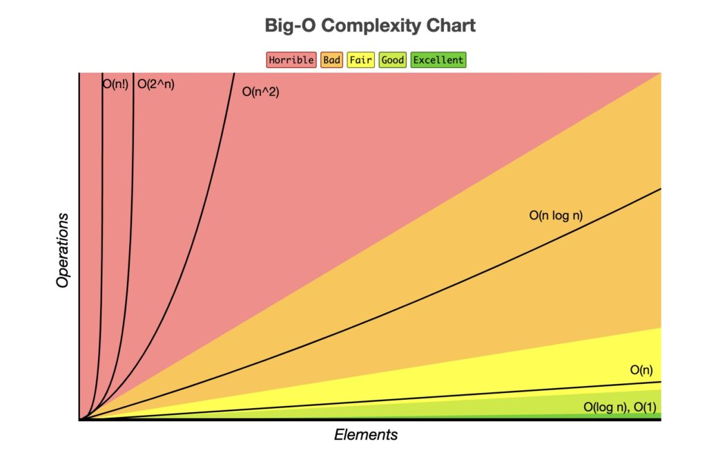

# 1. What is Algorithm Analysis?

- `Algorithm analysis` is a study to provide theoretical estimation for the required resources of an algorithm to solve a specific problem

- Generally, the efficiency an algorithm is related to the number of steps, know as `time complexity`, or volumne of memory, know as `space complexity`.

- Technically, there are `multiple` approaches to solve one problem. Algorithm analysis is performed to figure out which is the `more optimal` approach.

> Algorithm Analysis does not give you accurate values (time, space), however, it gives estimates which can be use to study the behavior of the algorithm.

# 2. What is a good algorithm?

- `Faster` (less execution time) - Time complexity.
- `Lighter` (less memory) - Space complexity.
- `Readable` (easy to read).

# 3. Big-O Notation

- To put it simple, `Big-O` describes the relationshop between the amount of `input data` and the amount of `operations` (runtime, memory) which the algorithm uses.

- The notation `O(n)` is the mathematical way to express the worst case of an algorithm's running time.

- Common time complexities:

| Big-O | Name | Example |
| --- | --- | --- |
| `O(1)`| Constant time | Statement, one line of code |
| `O(log n)`| Logarithm time | Binary search |
| `O(n)`| Linear time | Single loop
| `O(n log(n))`| Linearithmic time | Effective sorting algorithm (merge sort, heap sort, quick sort) |
| `O(n^2)`| Quadratic time | Double loop |
| `O(2^n)`| Exponential time | Complex full search
| `O(n!)`| Factorial time | Recursion
