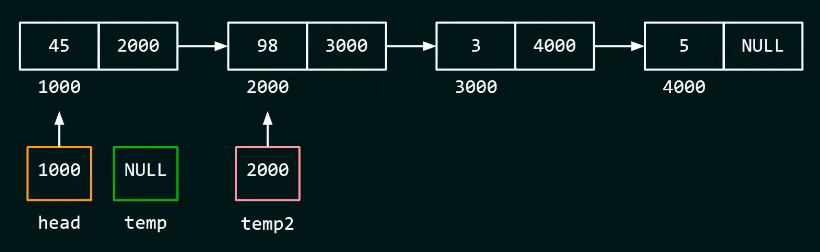
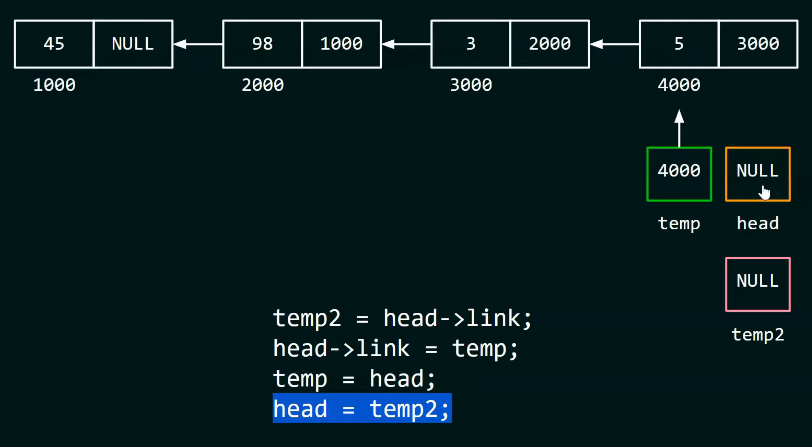

# 1. Introduction

- An array in C++ doesn't allow you to add or remove its element. If you want to do so, you must create a new array with a larger size, copy all the elements from the old array and finally add new element.

    

- Therefore, we can use `single linked list` which stores elements in separated parts of the memory. Linked list is a collection of entities called `Nodes`. Each node has `[value, link]`. So we are able to add (or remove) any new element in any position, as long as you specify a correct address.

    


    > **Time complexity** for array to look for an element is `O(1)` since you only need a `position`. However, when it comes to linked list, it is `O(n)`. Because first element has to look for the address of second element, second one looks for the address of third one, and so on.

### Array vs Linked list

| | Array | Linked list |
| --- | --- | --- |
| Time | O(1) | O(n) |
| Memory | fixed | expandable |

# 2. Implementation

## a. Create a Node

```cpp
struct Node {
    int data;
    Node *next; // pointer to the next node
};

int main() {
    Node* node = new Node;
    node -> data = 1;
    node -> next = NULL; // because it is the last Node so it point to nowhere

    cout << node->head << endl; // expect "1"

    return 0;
}
```

## b. Create a single linked list

- Since there is no element in the list, `head` and `tail` point to nowhere.

    ```cpp
    int main() {
        // ...

        Node* head = NULL;
        Node* tail = NULL;
    }
    ```

## c. Insert Node at the beginning

- First, we have to check whether a list is empty. If it is empty, set both `head` and `tail` to the new `Node`.

- If the list is not empty, add `Node` to the head.

    ```cpp
    if (head == NULL) {
        head = node;
        tail = node;
    } else {
        node -> next = head; // Set the new Node next pointer to the head
        head = node; // Head is now the new Node
    }
    ```

    

    > We are adding *Node 0* to the list. First, we point `next` of `Node 0` to the `head` (which is *Node 1*). Finally, we point `head` to `Node 0`.

## d. Insert Node at the end

- Similar to insertion at the beginning, we modify `tail` instead of `head`.

    ```cpp
    if (head == NULL) {
        head = node;
        tail = node;
    } else {
        tail -> next = node; // Update the next pointer of the current tail
        tail = node; // Tail is now the new Node
    }
    ```

    

    > We are adding *Node 6* to the list. `Tail` is currently *Node 5*. First, we use `next` to connect *Node 5* and *Node 6*. Finally, we assign `tail` to `Node 6`.

## e. Insert Node after a specific Node

> Since we haven't learn how to find a Node in list so we will create a function to insert Node

```cpp
void InsertAfterQ(Node* p, Node* q) {
    if (q != NULL) {
        p -> next = q -> next; // Next pointer of `p` is now the next pointer of `q`
        q -> next = p; // Next pointer of `q` is now `p`

        if (tail == q) {
            tail = p; // Assign tail to `p` if `q` is currently tail
        }
        
    }
}
```


## f. Delete first Node

> If the list is empty, we don't need to delete.

```cpp
if (head != NULL) {
    Node* node = head; // Store node head data
    head = head -> next; // Set the head pointer to the next node
    delete node; // Delete old head node
}
```


## g. Delete Node after a specific Node

```cpp
void DeleteAfterQ(Node* q) {
    if (q != NULL) {
        Node* p = q -> next; // Locate position of `p` (which is right after `q`)

        if (p != NULL) {
            q -> next = p -> next; // Update the next pointer of `q` to next pointer of `p` (since we are going to delete p)

            delete p;
        }
    }
}
```

## h. Print the list

- We will create a list with three nodes (1,2,3) and print out all nodes.

    ```cpp
    int main() {
        Node* head = NULL; // create head

        // Insert some nodes into the linked list (for demonstration)
        head = new Node(1); // assign new Node to null head
        head->next = new Node(2);
        head->next->next = new Node(3);
        
        Node* current = head;
        while (current != NULL) {
            cout << current -> data << " ";

            current = current -> next; // Move to next Node
        }
        
        return 0;
    }
    ```
## i. Get Node from a specific position

```cpp
Node* GetNode(int index) {
    Node* current = head; // Start from head
    int i = 0;

    while (current != NULL) {
        // If not the right index, move to the next node
        if (i != index) {
            current = current -> next;
            i++;
        } else {
            return current;
        }
    }

    return NULL;
}

int main() {
    // ...

    int nodeToRetrieve = 2;
    Node* nodeAtIndex = GetNode(nodeToRetrieve);

    cout << nodeAtIndex -> data;

    return 0;
}
```

## j. Find Node with given data

- Similar to `i. Get Node from specific position`, we only replace `index` by `data` to compare .

## k. Count Nodes in list

- Similarly, now we only need to loop through and count.

    ```cpp
    int Length()
    {
        int count = 0;
        Node* node = head;

        while (node != NULL) {
            count++;
            node = node->next;
        }
        
        return count;
    }
    ```

## l. Delete the entire list


- If we delete the first Node, we will lose the connection, which means we cannot reach the rest of the list


- Therefore, we have to store the address of the second Node somewhere so that we can reach it after the first Node is deleted.

- We create a pointer `temp` which points to the first Node. Now, both `head` and `temp` point to the first Node.


- Consequently, we move `head` to the second Node.


- Now, we can delete `temp` safely which means we delete the old first Node

```cpp
while (head != NULL) {
    Node* temp = head;
    head = head -> next;
    delete temp;

    // or we can use:
    // free(temp);
    // temp = NULL;
}
```

| Delete | Free |
| --- | --- |
| Allow full destruction of a Node which the pointer points to | Deallocate memory but doesn't call the destructor

```cpp
free(temp);
```


```cpp
temp = NULL;
```


## m. Reverse the list


- If we update the `link` of the first Node, we will lose connection to the rest of the list.

```cpp
head -> link = NULL;
```


- Therefore, we come up with another solution. First, we generate:

```cpp
temp = NULL;
temp2 = NULL;
```


- Our approach is to update `NULL` to the link of first Node but not losing the reference to the second Node. So, we need to keep a `pointer` which points to the second Node. Let's use `temp2`.

```cpp
temp2 = head -> link;
```



- Now we can safely update `link` of first Node to `NULL`

```cpp
head -> link = temp; // sice temp = NULL
```

- Now if we update `link` of second Node, we will lose reference to the rest.
- That is to say, we must move `head` pointer to the Node before we update its `link`.
- But before moving the `head` pointer, we have to keep a pointer which points to the first Node. Hence, we will use `temp`.

```cpp
temp = head;
```


- After that, we can move `head` pointer to the second Node, where `temp2` is pointing to.

```cpp
head = temp2;
```


- Final code should be:

```cpp
temp2 = head -> link;
head -> link = temp;
temp = head;
head = temp2;
```

- By repeating the following code, we can reverse the entire linked list. Here are the steps:


> When reaching the last Node, `temp2` will be set to `NULL` since there isn't next Node. Here is an example of implementation of last Node.




- We should stop the iteration when `head == NULL;`
- We have the final code:
```cpp
while (head != NULL) {
    temp2 = head -> link;
    head -> link = temp;
    temp = head;
    head = temp2;
}

head = temp; // Update head Node
```

> We can rename `temp = prev` and `temp2 = next` in order to understand more clearly.


