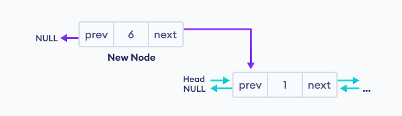
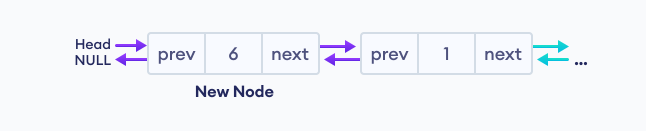
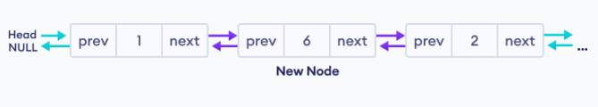
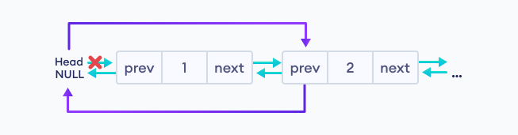

# 1. Introduction

- A `doubly linked list` is a type of linked list in which each node consists of 3 components:
    - `*prev`: address of previous node
    - `data`: data item
    - `*next`: address of next node

    

- Here is the illustration of a doubly-linked list:

    

<table>
<tr>
<th>Advantages</th>
<th>Disadvantages</th>
</tr>

<tr>
<td>
- We can perform forward or reverse look-up.
<br>
- We can insert or delete a node in front of a specific node easily.
</td>

<td>
- A node requires more memory.

</td>
</tr>
</table>

# 2. Implementation

- Firstly, we create Node structure and LinkedList

    ```cpp
    struct Node {
        int data;
        Node* next;
        Node* prev;

        // create constructor for adding data to node
        Node(int num) {
            data = num;
            next = NULL;
            prev = NULL;
        }
    };

    struct LinkedList {
        Node* head = NULL;
        Node* tail = NULL;
    }
    ```

- Next, we create a new Node. 

    ```cpp
    int main() {

        Node* node = new Node(1);
        LinkedList list;

        list.head = node;

        return 0;
    }
    ```

## a. Insert at the beginning

- First, we create a new Node

    ```cpp
    Node* node2 = new Node(2);
    ```

- Then, we connect that node to the front of the previous node.

    ```cpp
    node2->next = node;
    node->prev = node2;

    list.head = node2;

    // Actually we have to set `node2->prev=NULL`
    // but we've already declare it as default
    // in constructor
    ```

    
    

    > Insertion at the end has similar logic.


## b. Insert between two Nodes

```cpp
// Create new node
Node* node3 = new Node(3);

// Create connection
node3->next = node;
node3->prev = node2;
node2->next = node3;
node->prev = node3;
```



## c. Delete first Node

```cpp
// Locate the delete node which points the first Node
Node* temp = head;

// Safely move the head Node to the next Node
list.head = list.head->next;

// Delete the connection
list.head->prev = NULL;

// Delete old first node
delete temp;
```



## d. Delete a specific Node

```cpp
void deleteNthNode(LinkedList &l, int pos) {
    int count = 1;
    Node* current = l.head;

    while (current != NULL) {
        if (count == pos) {
            // If current is the last Node
            if (current->next == NULL) {
                current->prev->next = NULL;

            // If current is head node
            } else if (current->prev == NULL) {
                l.head = current->next;
                current->next->prev = NULL;

            // If current is inner node
            } else {
                current->next->prev = current->prev;
                current->prev->next = current->next;
            }

            delete current;
            break;
        }

        count++;
        current = current->next;
    }
}
```
