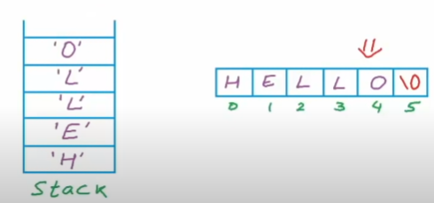

# 1. Introduction

- `Stack` is a linear data structure and it operates according to `LIFO` (Last In, First Out), which means the recently added element will be taken out first.
- Time complexity is `O(1)` - constant time.

- Basic operations on stacks are:
    - `IsEmpty()`: check for the emptiness of a stack.
    - `Push(int)`: add new element on top of a stack.
    - `Pop()`: take out the top element and return it value (if the stack is not empty).
    - `Top()`: return the value of top element.


# 2. Implementation

## a. Using array

- Firstly, we create an empty array. Since it is an empty array so `top` will be `-1`.

    ```cpp
    int A[10];
    int top = -1;
    ```

    

- Next, we create `Push(x)` function. Then, we increase `top` and fill in the new element.

    ```cpp
    void Push(x) {
        top++;
        A[top] = x;

        // or A[++top] = x;
        // which means `top` will be increased itself before implementation.
    }

    // Push(2);
    // Push(10);
    ```

    
    

- Similarly, we create `Pop()` function by decreasing `top`. We don't need to modify the old top value since it will be overwritten anyway when we `Push(x)` new element

    ```cpp
    void Pop() {
        top--;
    }
    ```

    

    > - The limitation of stack is that it will be overflown if `top` reaches the end of the array, so new increment will not be possible. Therefore, if we want to use `array` to implement `stack`, we have to create an array with significant size.
    > - For solution, we create a larger array whose size is twice bigger than the old one. Then, we copy all elements to the new array. This will cost `O(n)` with `n` is the number of elements.

- `Top()` function.

    ```cpp
    void Top() {
        return A[top];
    }
    ```

- `IsEmpty()` function.

    ```cpp
    int IsEmpty() {
        if (top == -1) {
            return 1;
        } else {
            return 0;
        }
    }
    ```

## b. Using linked list

- Similar to `linked list`:

    - Adding new element to stack is inserting new Node at the beginning.

    - Removing top element is deleting first Node.

    - Taking top element's value is taking first Node's data.

    ```cpp
    struct Node {
        int data;
        Node* next;

        Node(int num) {
            data = num;
            next = NULL;
        }
    }

    struct LinkedList {
        Node* head = NULL;
    }

    // Push function
    void push(LinkedList &l, int num) {

        Node* node = new Node(1);

        if (l.head == NULL) {
            l.head = node;
        } else {
            node->next = l.head;
            l.head = node;
        }
    }

    // Pop function
    void pop(LinkedList &l) {
        
        Node* temp = l.head;

        if (l.head != NULL) {
            l.head = head->next;
            delete temp;
        }
    }

    // Get top value
    int top(LinkedList &l) {
        if (l.head != NULL) {
            return l.head->data;
        } else {
            return -1;
        }
    }

    // Check empty list
    int isEmpty(LinkedList &l) {
        if (l.head == NULL) {
            return 1;
        } else {
            return 0;
        }
    }

    int main() {

        LinkedList list;

        // Example implementations
        isEmpty(list);
        push(list, 1);
        push(list, 2);
        pop(list);
        push(list, 3);
        top(list)

        return 0;
    }
    ```

# 3. Problems

## a. Reverse a string

- The idea is to put every character to a stack **in order**.

    

- Then, we use `Pop()` to take every element from top and overwrite them in order.

    

    ```cpp
    #include <iostream>
    #include <stack>
    #include <cstring> // for using strlen()
    using namespace std;

    void Reverse(char s[]) {

        int length = strlen(s);

        // Create empty stack
        stack<char> charStack;

        // Push each character into the stack
        for (int i=0; i<length; i++) {
            charStack.push(s[i]);
        }

        // Pop each character and overwrite it to the initial string
        for (int i=0; i<length; i++) {
            s[i] = charStack.top();
            charStack.pop();
        }
    }

    int main() {
        char s[] = "hello";
        
        cout << "Initial string: " << s << endl;

        Reverse(s);

        cout << "Reversed string: " << s << endl;

        return 0;
    }
    ```

#### <u>*Note:</u> We can also use `swap` to reverse a string, which is a better approach.

```cpp
void ReverseSwap(char s[]) {

    int length = strlen(s);
    int start = 0;
    int end = length-1;

    while (start < end) {
        char temp = s[start];
        s[start] = s[end];
        s[end] = temp;

        start++;
        end--;
    }
}
```


## b. Balance parentheses

- The problem is when we try to count opening and closing parentheses, it is not effective enough.

    

- Therefore, we come up with a solution:
    - Scan string from left to right.
    - If opening symbol, add it to a list.
    - If closing symbol, remove the last opening symbol in the list.

- If the last opening symbol in the last is not the same type as closing symbol, or the list is empty, stop the process.

    ```cpp
    int balanced(char s[]) {
        
        int length = strlen(s);
        stack<char> p;

        for (int i=0; i<length; i++) {
            
            // Push opening parentheses
            if (s[i] == '(' || s[i] == '[' || s[i] == '{') {
                p.push(s[i]);
            
            // Check for matching closing parentheses
            } else {
                if (!p.empty()) {
                    if (s[i] == ')' && p.top() == '(') {
                        p.pop();
                    } else if (s[i] == ']' && p.top() == '[') {
                        p.pop();
                    } else if (s[i] == '}' && p.top() == '{') {
                        p.pop();
                    } else {
                        return 0;
                    }
                } else {
                    return 0;
                }
            }
        }

        // Empty means all parentheses are valid
        if (p.empty()) {
            return 1;
        } else {
            return 0;
        }
    }
    ```