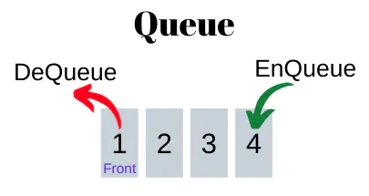
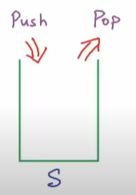
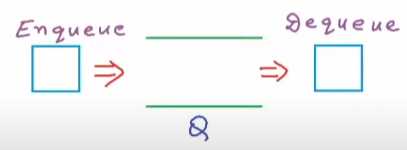
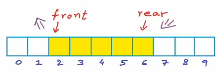
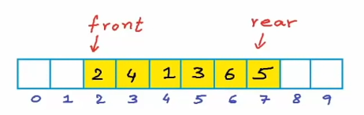
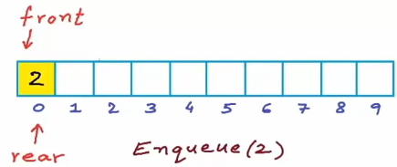
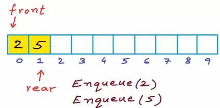
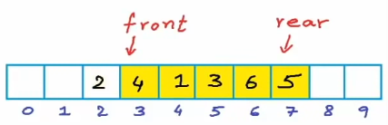
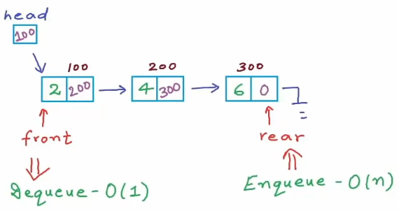

# 1. Introduction

- `Queue` is a linear data structure which operates according to `FIFO` (First In, First Out), which means first added element will be taken out first.

    

- Basic operations of queue are:
    - `EnQueue(x)` or `Push(x)`: add an element to the tail (rear).
    - `DeQueue(x)` or `Pop()`: take out first element from head (front).
    - `Front()` or `Peek()`: return head element's value.
    - `IsEmpty()`: Check for emptiness.

| Stack | Queue |
| --- | --- |
| Insertion and deletion implement from `one side`. | Insertion and deletion implement from `two side`. |
|  |  |

# 2. Implementation

## a. Using array

- First, we create and array.

    ```cpp
    int A[10];
    int front = -1;
    int rear = -1;

    int IsEmpty() {
        if (front==-1 && rear==-1) {
            return 1;
        } else {
            return 0;
        }
    }
    ```

    

- Then we can insert `5` to the rear.

    

- To enqueue, we increase `rear` and insert new element to that position.

    ```cpp
    void Enqueue(int x) {
        int size = sizeof(A)/sizeof(int);

        // Cannot insert if queue is full
        if (rear < size-1) {
            if (IsEmpty()) {
                front = 0;
                rear = 0;
            } else {
                rear++;
            }

            A[rear] = x;
        }

    }
    ```

    
    

- To dequeue, we increase `front` position.

    

    ```cpp
    void Dequeue() {
        if (!isEmpty()) {
            if (front==rear) {
                front = -1;
                rear = -1;
            } else {
                front++;
            }
        }
    }
    ```

## b. Using linked list



```cpp
// Store each Node's value
struct Node {
    int data;
    Node* next;

    Node(int num) {
        data = num;
        next = NULL;
    }
};

// Store head and tail of a list
struct LinkedList {
    Node* head = NULL;
    Node* tail = NULL;
};

void Print(LinkedList &l) {
    Node* current = l.head;
    
    while (current != NULL) {
        cout << current->data << " ";
        current = current->next;
    }
    
    cout << endl;
}

int isEmpty(LinkedList &l) {
    if (l.head==NULL && l.tail==NULL) {
        return 1;
    } else {
        return 0;
    }
}

int Front(LinkedList &l) {
    if (!isEmpty(l)) {
        return l.head->data;
    } else {
        return -1;
    }
}

// Insert new Node to the tail
void Enqueue(LinkedList &l, int x) {
    Node* node = new Node(x);
    
    if (isEmpty(l)) {
        l.head = node;
        l.tail = node;
    } else {
        l.tail->next = node;
        l.tail = node;
    }
}

// Remove head Node
void Dequeue(LinkedList &l) {
    Node* temp = l.head;
    l.head = l.head->next;
    delete temp;
}

int main() {
    
    LinkedList list;
    
    Enqueue(list, 1);
    Enqueue(list, 2);
    Enqueue(list, 3);
    Dequeue(list);
    Front(list);
    Print(list);

    return 0;
}
```