# 2. Binary Search Tree (BST)

## a. Time complexity comparison

| | Array (unsorted) | Linked list | Array (sorted) | BST (balanced) |
| :---: | :---: | :---: | :---: | :---: |
| Search(x) | O(n) | O(n) | O(log n) | O(log n) |
|Insert(x) | O(1) | O(1) | O(n) | O(log n) |
| Remove(x) | O(n) | O(n) | O(n) | O(log n) |

## b. Definition

- A `Binary Search Tree` is a tree in which for each node, value of all nodes in `left subtree is lesser or equal` and value of all nodes in `right subtree is greater`.

    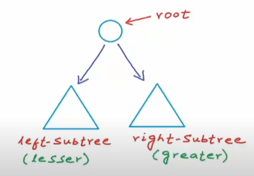
    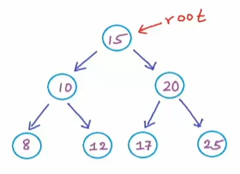

    > This tree below is not a Binary Search tree since `16` (on the left of root) is greater than `15` (root).
    >
    > 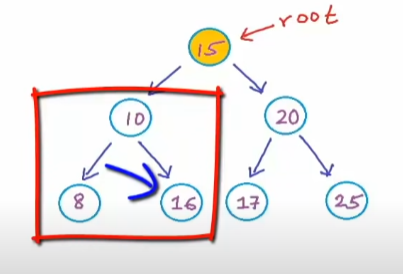

## c. Idea

- To perform a binary search, we have to define our search space.

    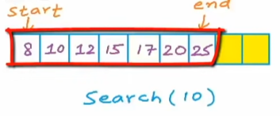

- Then, we compare our number with the middle element. If our number is `lesser`, we will go searching in the `left`. Now, our search space is reduced by half.
- We keep comparing with the middle element until we find the right number.
- The search space reduces by half of previous value: `n -> n/2 -> n/4 -> ... -> 1`.

    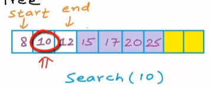

- Let's take a look at binary search tree traversal.

    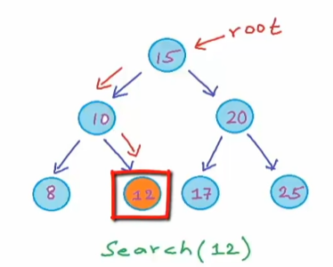

- To insert a new element to a binary tree, we have to find a suitable position by comparing as what we've done previously.
`Lesser -> left, Greater -> right`.

    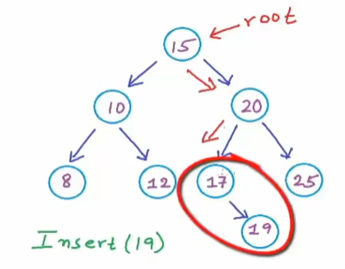

# 3. Implementation for BST

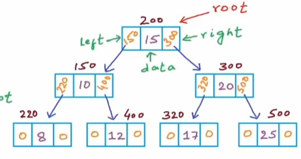

- First, we create a Node structure to create node.

    ```cpp
    struct Node {
        int data;
        Node* left;
        Node* right;

        Node(int num) {
            data = num;
            left = right = NULL;
        }
    }
    ```

## a. Insert

- Since `Node* root` is only a local variable, which means it doesn't affect the original `root`. So if we want to update the root, we have to return a newly modified root in our `Insert()` and update `root` in `main()` every time.

    > We can also use `double pointer` to modify.

    ```cpp
    Node* Insert(Node* root, int num) {

        // If tree is empty, create a new node and set it to root
        if (root == NULL) {
            return new Node(num);
        
        } else if (num < root->data) {
            root->left = Insert(root->left, num);
        
        } else if (num > root->data) {
            root->right = Insert(root->right, num);
        }

        return root;
    }

    int main() {

        Node* root = NULL; // pointer to empty root node
        
        root = Insert(root, 15);
        root = Insert(root, 10); // root is NULL so a new Node will be created
        root = Insert(root, 20);
        root = Insert(root, 25);

        return 0;
    }
    ```

    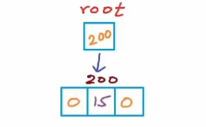
    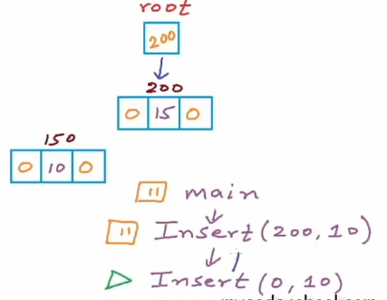
    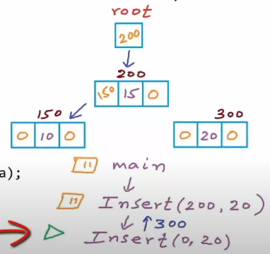
    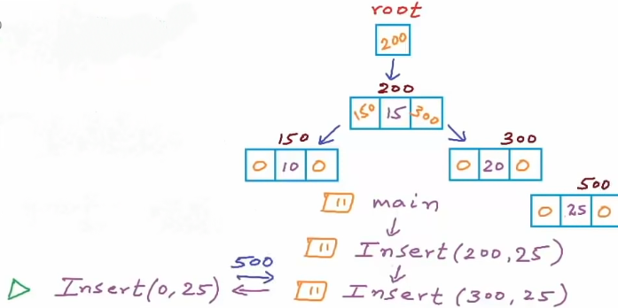


- As soon as the `recursion` reaches lowest stage `root == NULL` (which means the new leaf Node is created), it will go up stage by stage until it reach the highest root.

- In case when new Node is equal to root Node, do nothing because it will create duplicated nodes.

## b. Search

```cpp
Node* Search(Node* root, int num) {
    if (root == NULL) {
        return NULL;
    }

    if (num == root->data) {
        return root;
    } else if (num < root->data) {
        return Search(root->left, num);
    } else {
        return Search(root->right, num);
    }
}

int main() {
    // ...

    Node* result = Search(root, 25);

    return 0;
}
```

> - `root == NULL`: This part checks if the current node root is NULL, which means we've reached the end of a branch in the BST without finding the target value. If this is true, the function returns NULL.
>
> - `num == root->data`: This part checks if the data in the current node root is equal to the target value we are searching for. If this is true, it means we have found the node with the target value, so the function returns the root node.

- The recursion continues until it reaches NULL point or find the correct Node.

# 4. Delete a node

- Deleting a node is a process of searching and removing one node without affecting the structure of BST. A tree after deletion can be varied as long as it still hold the proper structure of BST.

- There are 3 cases in node deletion:

    - `Case 1 (easiest)`: Node with no child (leaf node).
    - `Case 2 (medium)`: Node with one child.
    - `Case 3 (hard)`: Node with 2 children.

    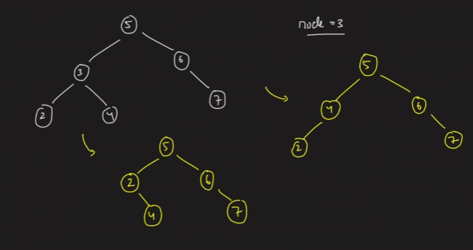
    
- In `case 3`, we have two ways to appropriately delete a node:
    - Find min in right -> Copy its value to the target node -> Delete min node in right subtree.

        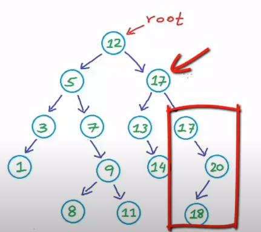
    
    - Find max in left -> Copy its value to the target node -> Delete max node in left subtree.

        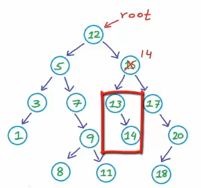


    ```cpp
    Node* findMin(Node* node) {
        while (node->left != nullptr) {
            // The last left node is the minimum node
            node = node->left;
        }
        return node;
    }

    Node* Delete(Node* root, int data) {
        
        if (root == NULL) {
            return root;

        // Node in the left subtree
        } else if (data < root->data) {
            
            // Modify root of left subtree after deletion
            root->left = Delete(root->left, data);

        // Node in the right subtree
        } else if (data > root->data) {

            // Modify root of right subtree after deletion
            root->right = Delete(root->right, data);

        // Found the Node to be deleted
        } else {

            // Case 1: no child
            if (root->left == nullptr && root->right == nullptr) {
                delete root;
                root = nullptr;
                return root;
            
            // Case 2: one child
            // Cut the root node -> Return the remained subtree -> Connect the subtree to `root->left` or `root->right` above.
            } else if (root->left == nullptr) {
                Node* temp = root->right;
                delete root;
                root = nullptr;
                return temp;

            } else if (root->right == nullptr) {
                Node* temp = root->left;
                delete root;
                root = nullptr;
                return temp;

            // Case 3: two children
            } else {
                
                // Find minimum node
                Node* temp = findMin(root->right);

                // Copy value to target (root) node
                root->data = temp->data;

                // Delete the minimum node
                root->right = Delete(root->right, temp->data);
            }

        }

        return root;
    }
    ```

    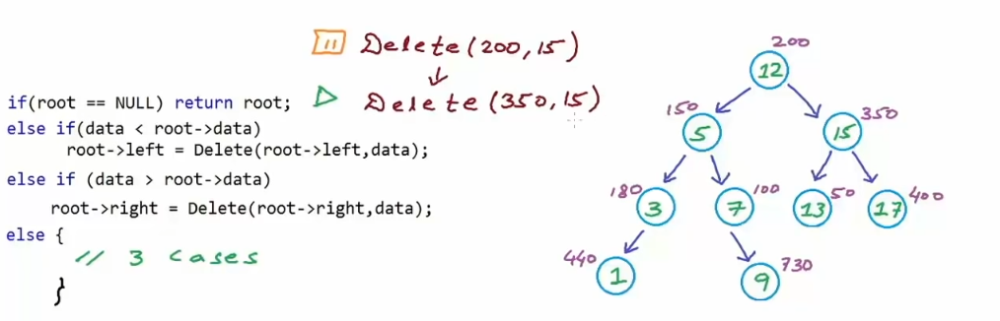
    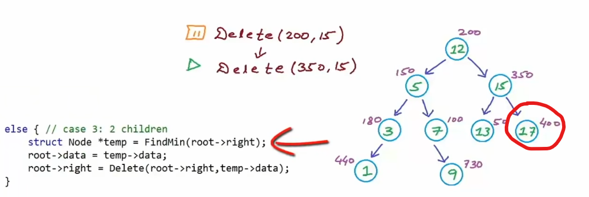
    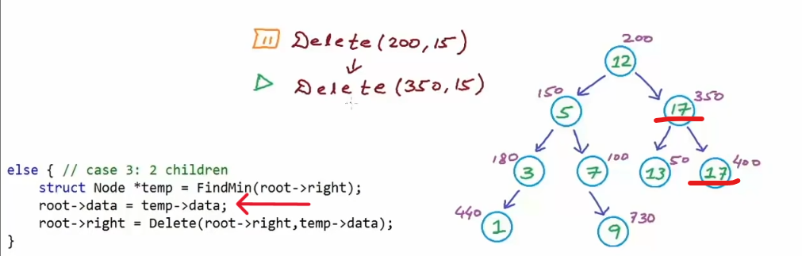
    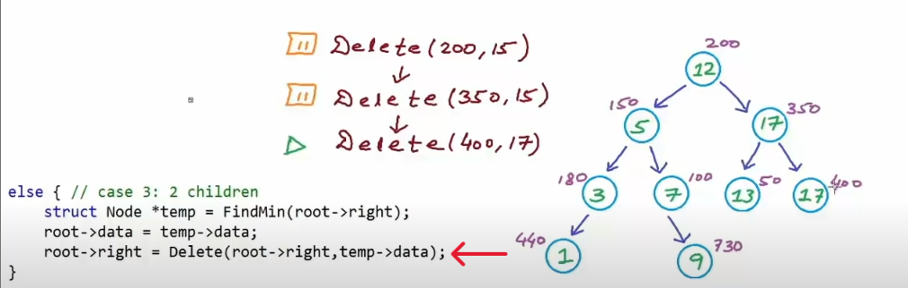

*This is case 1 so we can simple delete the node*

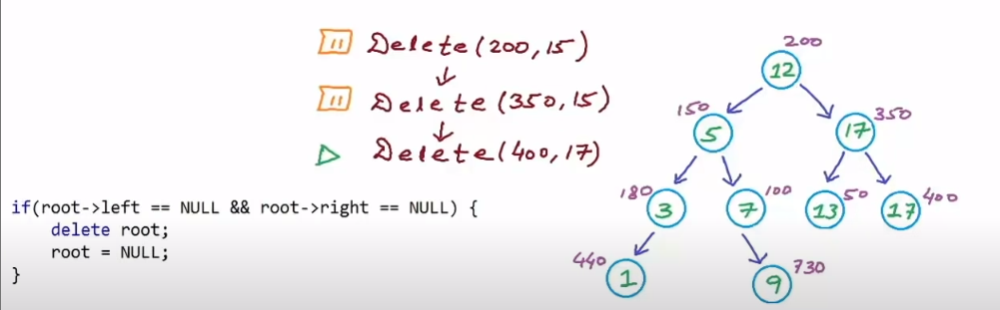
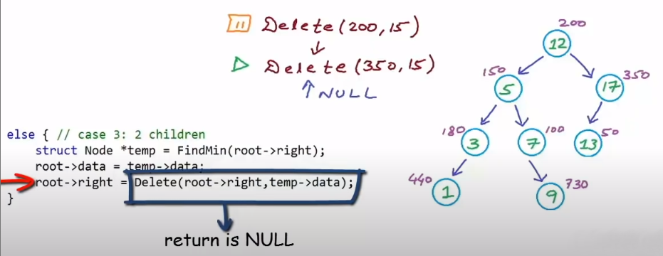


# 5. Memory allocation

- The application memory is divided into 4 segments:

    - `Code (Text)`
    - `Static/Global`
    - `Stack`
    - `Heap`: dynamic size

# 6. Problems

## a. Min, Max

- Solution 1: Using recursion (no root modification).

    ```cpp
    Node* Max(Node* root) {
        // Empty tree
        if (root == NULL) {
            return NULL;
        }

        // The last node in right is max
        if (root->right == NULL) {
            return root;
        }

        // Continue traversing to right
        return Max(root->right);
    }

    Node* Min(Node* root) {
        // Empty tree
        if (root == NULL) {
            return NULL;
        }

        // The last node in left is min
        if (root->left == NULL) {
            return root;
        }

        // Continue traversing to left
        return Min(root->left);
    }
    ```

- Solution 2: using while loop which modifies root `locally` (without affecting original root).

    ```cpp
    int Max(Node* root) {
        // empty tree
        if (root == NULL) {
            return -1;
        }

        // Start traversing to right until reaching the last right node
        while (root != NULL) {
            root = root->right;
        }

        return root->data;
    }

    int Min(Node* root) {
        // empty tree
        if (root == NULL) {
            return -1;
        }

        // Start traversing to left until reaching the last left node
        while (root != NULL) {
            root = root->left;
        }

        return root->data;
    }
    ```

## b. Height of tree

- Solution 1: Using separated while loop.

    ```cpp
    int Height(Node* root) {
        int countLeft = 0;
        int countRight = 0;

        if (root == NULL) {
            return -1;
        }

        Node* current = root;
        while (current->left != NULL) {
            countLeft++;
            current = current->left;
        }

        current = root;
        while (current->right != NULL) {
            countRight++;
            current = current->right;
        }

        if (countLeft < countRight) {
            return countRight;
        } else {
            return countLeft;
        }
    }
    ```

- Solution 2: Using recursion

    ```cpp
    int Height(Node* root) {
        if (root == nullptr) {
            return -1; // Height of an empty tree is -1
        }

        int leftHeight = Height(root->left);
        int rightHeight = Height(root->right);

        return max(leftHeight, rightHeight) + 1; // Height is the maximum of left and right subtree heights plus 1
    }
    ```

## c. Check if a given binary tree is BST

> *A `Binary Search Tree` is a tree in which for each node, value of all nodes in left subtree is lesser or equal and value of all nodes in right subtree is greater.*

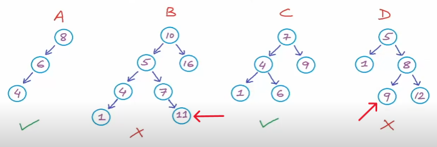

- Node is valid if it is in a `range`:
    - To the left, it must be `lesser` than parent Node.
    - To the right, it must be `greater` than parent Node.

- For example, we are going to check for this tree.

    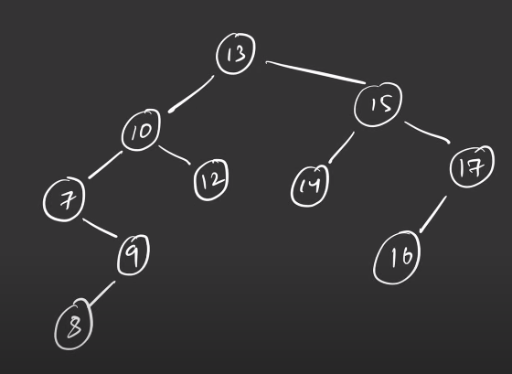

- Initially, the root's range is `[-INT_MIN, INT_MAX]`. In this case, `-INT_MIN < 13 < INT_MAX`, so it is a valid node. Then we go checking its children.

- On the `left` subtree, its range should be `[-INT_MAX, 13]` since it must be lesser than its parent (which is 13). Similarly, on the `right` subtree, its range is `[13, INT_MAX]`. Therefore, let's perform left recursion first, then the right recursion.

    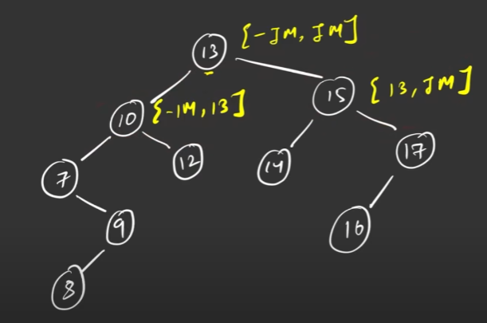

- `-IM < 10 < 13` so `10` is valid.

- Then, we go to the left child, which means the range should be `[-IM, 10]` so `7` is valid. On the right child, the range is `[10, 13]` so `12` is valid.

    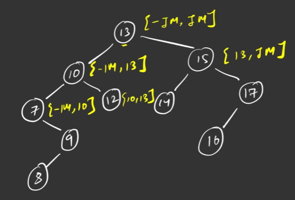

- When we reach `9` (on the right of 7), the range is `[7, 10]` so `9` is valid.
- `8` is left child of 9 so the range should be `[7, 9]` so `8` is valid.

    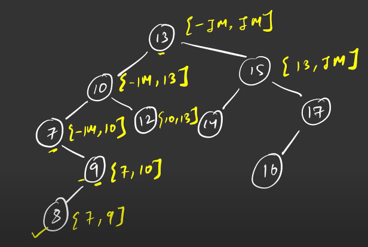

- Since we have reached the last node, the function end and return `True`. Then the recursion will be exited back step until it reach the `root`. Therefore, the `left subtree` is fully valid. Then, we can recursively check for the `right subtree` as what we have done to the left one.

    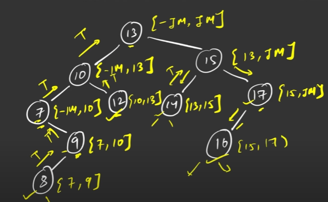

    ```cpp
    #include <climits>

    // ...

    bool isBST(Node* root, int min = INT_MIN, int max = INT_MAX) {

        // Reach the leaf node
        if (root == nullptr) {
            return true; 
        }

        // Value is out of range [min, max]
        if (root->data <= min || root->data >= max) {
            return false;
        }

        // Recursively update new range for left and right subtree
        return isBST(root->left, min, root->data) && isBST(root->right, root->data, max);
    }
    ```