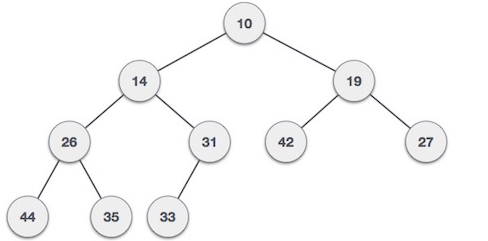

# 1. Introduction

- `Heap` is a Complete Binary Tree.

- `Min-Heap`: root node must be minimun among all of its children.

    

- `Max-Heap`: root node must be greatest among all of its children

    

- Operations of Heap:

    - `getMin()`/`getMax()`: return the root node of Min-heap/Max-heap.

    - `extractMin()`/`extractMax()`: remove node node of Min-heap/Max-heap.

    - `insert(n)`: add new node at the end of heap.

    - `delete(n)`: remove node at the end of heap.

    - `heapify()`

- Formulas to get node from heap `A[]`:

    - `A[(i-1)/2]`: return PARENT node.
    - `A[(2*i)+1]`: return LEFT child node.
    - `A[(2*i)+2]`: return RIGHT child node.

# 2. Implementation

## a. Build heap from array

```cpp
void heapify(int arr[], int size, int index) {

    // Assume the current node is largest
    int largest = index;
    
    // Calculate the index of left and right child
    int left = (2 * index) + 1;
    int right = (2 * index) + 2;

    // Check if the left is larger than the current largest
    if (left < size && arr[left] > arr[largest]) {
        largest = left;
    }

    // Check if the right is larger than the current largest
    if (right < size && arr[right] > arr[largest]) {
        largest = right;
    }

    // If the largest node is not the current node, swap them and recursively heapify
    if (largest != index) {
        swap(arr[index], arr[largest]);
        heapify(arr, size, largest);
    }
}

void buildMaxHeap(int arr[], int size) {
    // Start from the last non-leaf node (usually the middle node) and heapify all the way up to the root
    for (int i = size / 2 ; i >= 0; i--) {
        heapify(arr, size, i);
    }
}
```

### * How does it work?

- First we create a heap from an array `A[]`.

    

- Then, we start to heapify from the `middle` element of the array, which is at index `2` and `A[2] = 3`. 
- Since left and right child node of `3` is null, `largest` still remain its value so there will be no recursive execution.

    

- Then, we can decrease `i = i-1 = 2-1 = 1` and `A[1] = 2`.
- Since left child is `A[3]=9 > A[1]=2`, we swap two elements.

    

- Next, we recursively call `heapify`. Now, `largest` is at index 3 and `A[3]=2`. However, left and right child of the node is null so there will be no execution.

- Then, we continue dereasing `i = i-1 = 1-1 = 0` and `A[0]=1`.
- Since left child is `A[1]=9 > A[0]=1`, we swap two elements.

    

- Then, we recursively call `heapify` with `largest = 1` at index `1`.
- Since right is `A[4]=7 > A[1]=1`, we swap two elements.

    

- We continue calling `heapify` with `largest = 1` at index `4`. Since left and right child of that element is null, we do not execute.

- Now we've reached the end of for loop, we stop the function.

## b. Heap sort

- We simply modify our created function `buildMaxHeap()`.

```cpp
void heapSort(int arr[], int size) {
    // Build max heap from the array
    for (int i = size / 2 ; i >= 0; i--) {
        heapify(arr, size, i);
    }

    // Swap first and last element, then heapify with decreasing length
    for (int i = size-1; i > 0; i--) {

        // Move the first (maximum) element to the end
        swap(arr[0], arr[i]);
        
        // Heapify the reduced heap
        headpify(arr, i, 0);
    } 
}
```

- Similar to `Bubble Sort`, the maximum element of each iteration is shifted to the end of the array

    