# 1. Tree traversal

- There are two approaches, which are: `breadth-first search (BFS)` and `depth-first search (DFS)`.

- In `Breadth-first`, we visit nodes which are on the same level.

    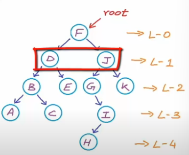

- In `Depth-first`, we visit the complete subtree of each left (or right) part.

    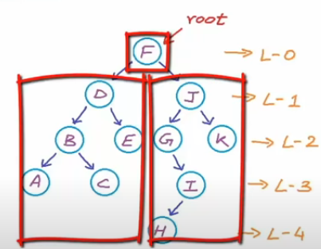
    - `Pre-order`: root -> left -> right.
    - `In-order`: left -> root -> right.
    - `Post-order`: left -> right -> root.


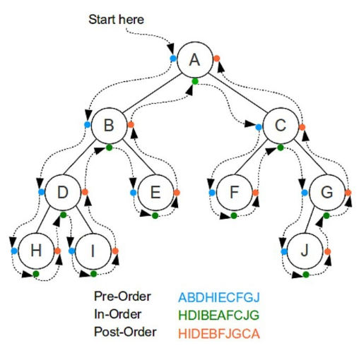

## a. Pre-order traversal

- We traverse through all left nodes, when we reach the last left node, we come back to its parent and go to the right child. Then, we repeat the process until all nodes are printed out.

    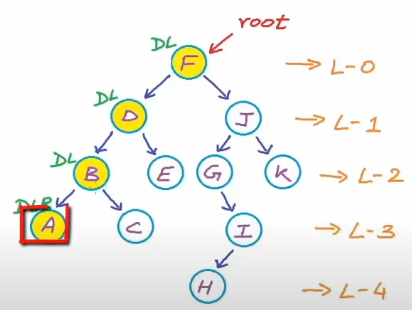
    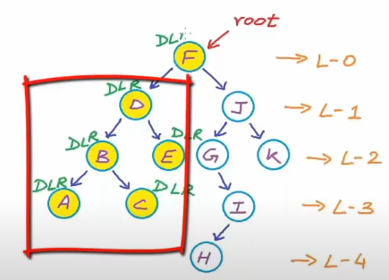

    ```cpp
    void preorderTraversal(Node* root) {
        // go back if come over the leaf node
        if (root == NULL) {
            return;
        }

        cout << root->data << " ";

        // Traverse through left subtree
        preorderTraversal(root->left);

        // Traverse through right subtree
        preorderTraversal(root->right);
    }
    ```

## b. In-order traversal

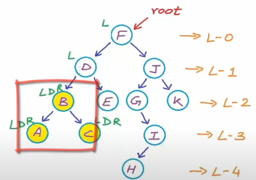
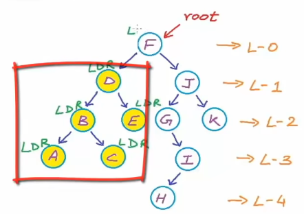

```cpp
void inorderTraveral(Node* root) {
    // come back if come over the leaf node
    if (root == NULL) {
        return;
    }

    inorderTraversal(root->left);

    cout << root->data << " ";

    inorderTraversal(root->right);
}
```

## c. Post-order traversal

## d. Level-order traversal

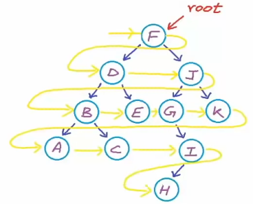

- As we visit each node, we mark that node as visited by enqueuing its address to the `Queue`. Then, we dequeue the address, print out the value and enqueue its children's address. Consequently, we repeats the steps until we reach the lowest level.

- For example, we start from root Node by enqueuing its address to the `Queue`.

    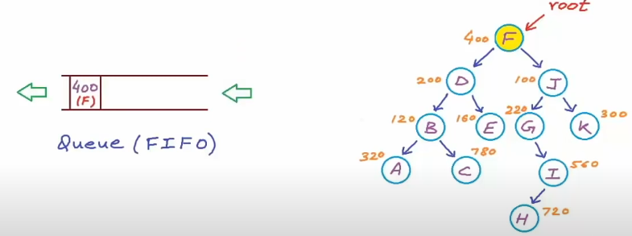

- Since our root Node has children, we will dequeue its address and enqueue the children's address.

    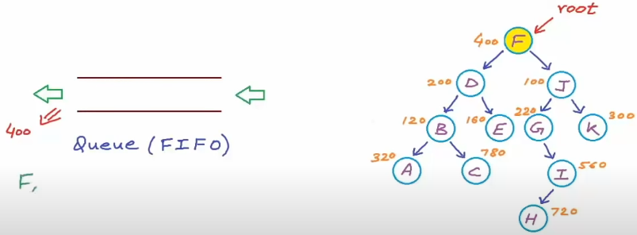
    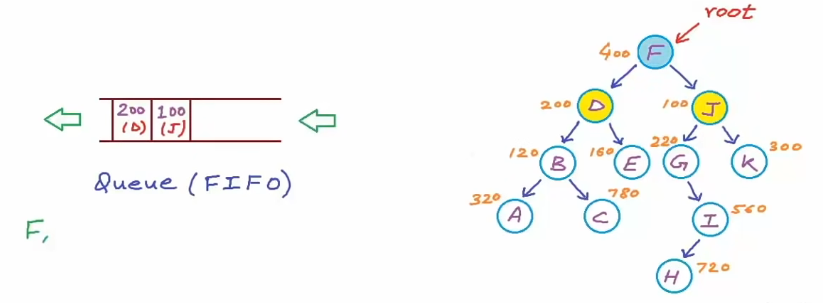

    > When using a Queue, we won't lose the address of Nodes as we move to the lower levels. Moreover, the order is correct.

- Here are some next steps:

    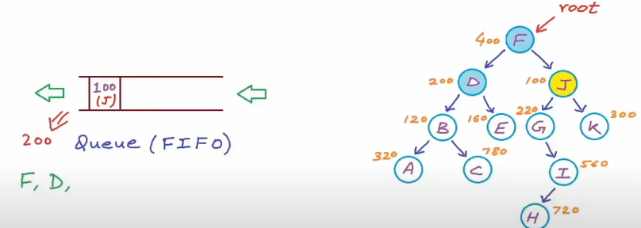
    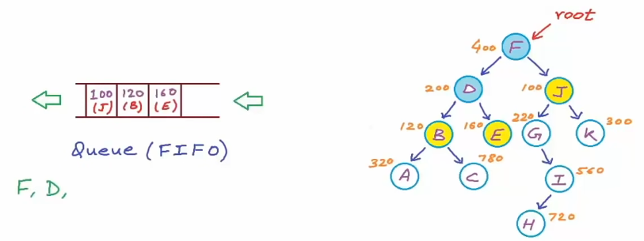
    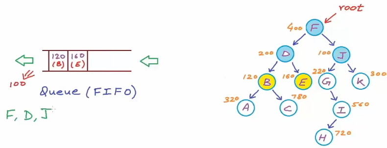
    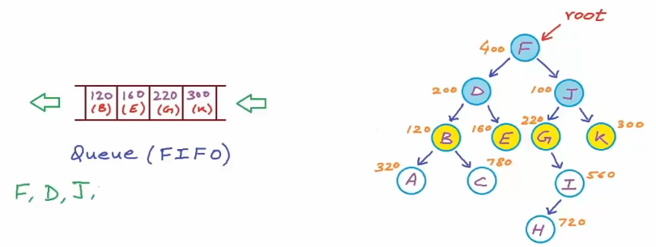

    ```cpp
    void levelOrderTraversal(bstNode* root) {

        if (root == NULL) {
            return;
        } else {
            queue<bstNode*> Q;
            Q.push(root);

            while (!Q.empty()) {
                bstNode* current = Q.front();
                cout << current->data << " ";

                if (current->left != NULL) {
                    Q.push(current->left);
                }

                if (current->right != NULL) {
                    Q.push(current->right);
                }

                Q.pop();
            }

        }
    }
    ```

