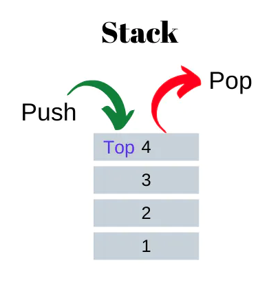
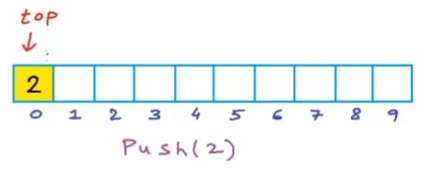
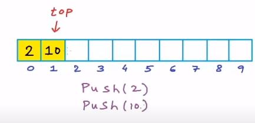
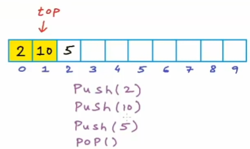
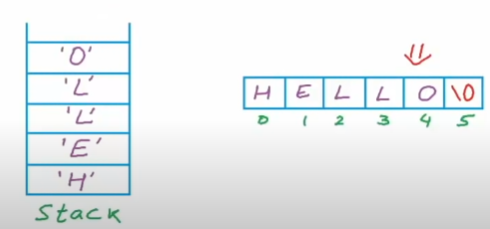
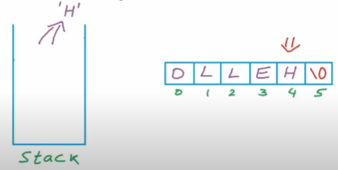
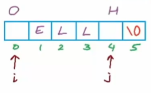
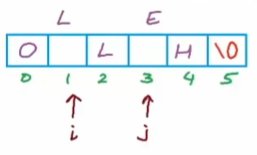
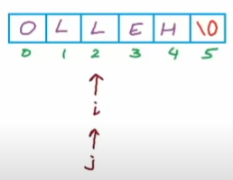
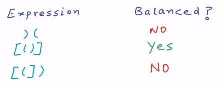

# 1. Introduction

- `Stack` is an abstract data type and it operates according to `LIFO` (Last In, First Out), which means the recently added element will be taken out first.
- Time complexity is `O(1)` - constant time.

- Basic operations on stacks are:
    - `IsEmpty()`: check for the emptiness of a stack.
    - `Push(int)`: add new element on top of a stack.
    - `Pop()`: take out the top element and return it value (if the stack is not empty).
    - `Top()`: return the value of top element.



# 2. Implementation

## a. Using array

- Firstly, we create an empty array. Since it is an empty array so `top` will be `-1`.

```cpp
int A[10];
int top = -1;
```


- Next, we create `Push(x)` function. Then, we increase `top` and fill in the new element.

```cpp
void Push(x) {
    top++;
    A[top] = x;

    // or A[++top] = x;
    // which means `top` will be increased itself before implementation.
}

// Push(2);
// Push(10);
```




- Similarly, we create `Pop()` function by decreasing `top`. We don't need to modify the old top value since it will be overwritten anyway when we `Push(x)` new element

```cpp
void Pop() {
    top--;
}
```



> - The limitation of stack is that it will be overflown if `top` reaches the end of the array, so new increment will not be possible. Therefore, if we want to use `array` to implement `stack`, we have to create an array with significant size.
> - For solution, we create a larger array whose size is twice bigger than the old one. Then, we copy all elements to the new array. This will cost `O(n)` with `n` is the number of elements.

- `Top()` function.

```cpp
void Top() {
    return A[top];
}
```

- `IsEmpty()` function.

```cpp
int IsEmpty() {
    if (top == -1) {
        return 1;
    } else {
        return 0;
    }
}
```

## b. Using linked list

- Similar to `linked list`:
    - Adding new element to stack is inserting new Node at the beginning.
    - Removing top element is deleting first Node.
    - Taking top element's value is taking first Node's data.

```cpp
struct Node {
    int data;
    Node* next;

    Node(int num) {
        data = num;
        next = NULL;
    }
}

struct LinkedList {
    Node* head = NULL;
}

// Push function
void push(LinkedList &l, int num) {

    Node* node = new Node(1);

    if (l.head == NULL) {
        l.head = node;
    } else {
        node->next = l.head;
        l.head = node;
    }
}

// Pop function
void pop(LinkedList &l) {
    
    Node* temp = l.head;

    if (l.head != NULL) {
        l.head = head->next;
        delete temp;
    }
}

// Get top value
int top(LinkedList &l) {
    if (l.head != NULL) {
        return l.head->data;
    } else {
        return -1;
    }
}

// Check empty list
int isEmpty(LinkedList &l) {
    if (l.head == NULL) {
        return 1;
    } else {
        return 0;
    }
}

int main() {

    LinkedList list;

    // Example implementations
    isEmpty(list);
    push(list, 1);
    push(list, 2);
    pop(list);
    push(list, 3);
    top(list)

    return 0;
}
```

# 3. Problems

## a. Reverse a string

- The idea is to put every character to a stack **in order**.



- Then, we use `Pop()` to take every element from top and overwrite them in order.



```cpp
#include <iostream>
#include <stack>
#include <cstring> // for using strlen()
using namespace std;

void Reverse(char s[]) {

    int length = strlen(s);

    // Create empty stack
    stack<char> charStack;

    // Push each character into the stack
    for (int i=0; i<length; i++) {
        charStack.push(s[i]);
    }

    // Pop each character and overwrite it to the initial string
    for (int i=0; i<length; i++) {
        s[i] = charStack.top();
        charStack.pop();
    }
}

int main() {
    char s[] = "hello";
    
    cout << "Initial string: " << s << endl;

    Reverse(s);

    cout << "Reversed string: " << s << endl;

    return 0;
}
```

#### <u>*Note:</u> We can also use `swap` to reverse a string, which is a better approach.

```cpp
void ReverseSwap(char s[]) {

    int length = strlen(s);
    int start = 0;
    int end = length-1;

    while (start < end) {
        char temp = s[start];
        s[start] = s[end];
        s[end] = temp;

        start++;
        end--;
    }
}
```





## b. Balance parentheses

- The problem is when we try to count opening and closing parentheses, it is not effective enough.



- Therefore, we come up with a solution:
    - Scan string from left to right.
    - If opening symbol, add it to a list.
    - If closing symbol, remove the last opening symbol in the list.

- If the last opening symbol in the last is not the same type as closing symbol, or the list is empty, stop the process.

```cpp
int balanced(char s[]) {
    
    int length = strlen(s);
    stack<char> p;

    for (int i=0; i<length; i++) {
        
        // Push opening parentheses
        if (s[i] == '(' || s[i] == '[' || s[i] == '{') {
            p.push(s[i]);
        
        // Check for matching closing parentheses
        } else {
            if (!p.empty()) {
                if (s[i] == ')' && p.top() == '(') {
                    p.pop();
                } else if (s[i] == ']' && p.top() == '[') {
                    p.pop();
                } else if (s[i] == '}' && p.top() == '{') {
                    p.pop();
                } else {
                    return 0;
                }
            } else {
                return 0;
            }
        }
    }

    // Empty means all parentheses are valid
    if (p.empty()) {
        return 1;
    } else {
        return 0;
    }
}
```