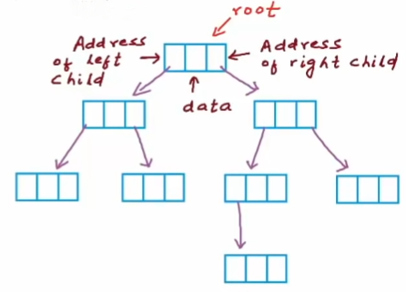
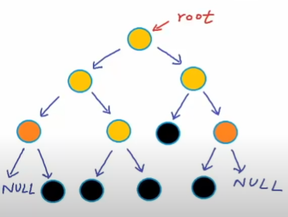
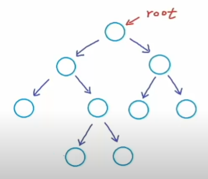
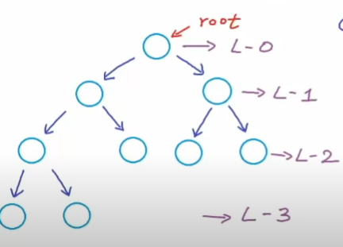
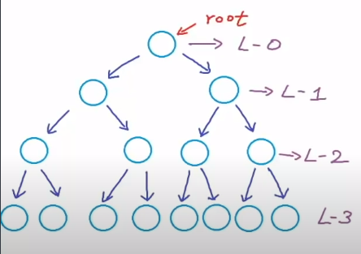
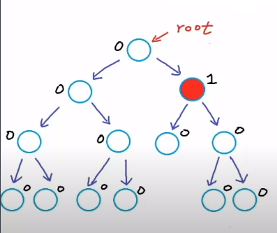

# 1. Binary Tree

- `Binary Tree` is a tree where each node consists **at most 2 children**.



```cpp
struct Node {
    int data;
    Node* left; // address of left child
    Node* right; // address of right child
}
```

- If a node doesn't have left (or right) child, that edge will points to `NULL`. A node with no child is called `leaf node` (both left and right point to `NULL`).



- A `Strict/Proper binary tree` is a tree where each node consists of either 2 or 0 children.



- A `Complete Binary tree` is a tree whose all levels (except the lasts) are completely filled and all nodes are `as left as possible`.



- A `Perfect Binary tree` is a tree whose all nodes are completely filled.



> Maximum number of nodes in a binary tree with height `h` is calculated by: T = 2^0 + 2^1 + ... + 2^h = 2^(h+1) - 1

- A `Balanced binary tree` is a tree which the difference between height of left and right subtree for every node is `not more than K` (mostly 1).
- `diff = |h(left)- h(right)|`

> - Height of an empty tree = -1
> - Height of a tree with one node = 0

