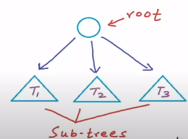
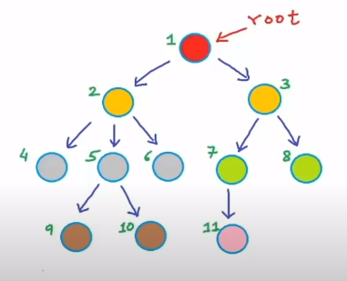
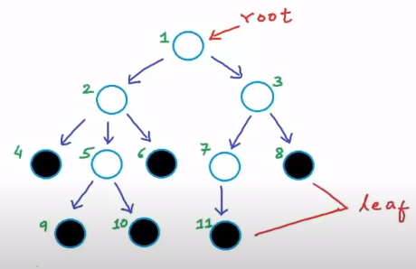
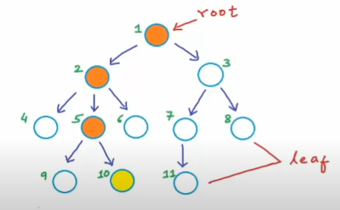
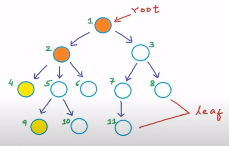
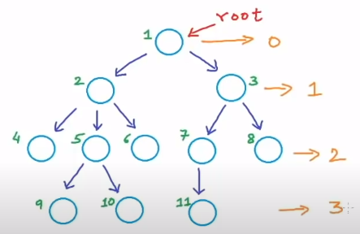
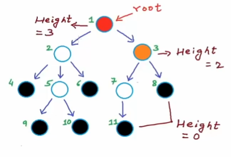

# 1. Introduction

- Tree is a recursive (non-linear) data structure which consists of `root` and some `sub-trees`.

- There are some common terms in `Tree` data structure, which ares:
    - `Root`: highest level
    - `Parent`
    - `Grandparent`: parent of parent
    - `Children`
    - `Sibling`: nodes at same level
    - `Leaf`: nodes which don't have child

> According to this image:
> - **1** is `root` and appears once.
> - **2** and **3** are `children` of **1**.
> - **2, 3** or **4,5,6** or **7,8** are `sibling`.

- There are also other terms: `Ancestor` and `Desecendent`.
    - **1,2,5** are ancestors of **10**.
    - **10** is descendent of **1,2,5**

- In this image below, **1,2** are `common ancestors` of **4** and **9**

- In a tree with `N` nodes, it has `N-1` links (or called edges).

- We also have terms called `Depth and height`.
    - `Depth` of a node is the number of edges from root to node. 

    - `Height` of node is the number of edges from node to the farthest leaf.  

    - `Height of tree` is height of root node.