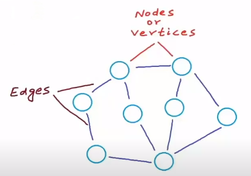
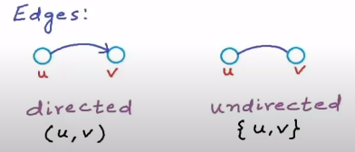
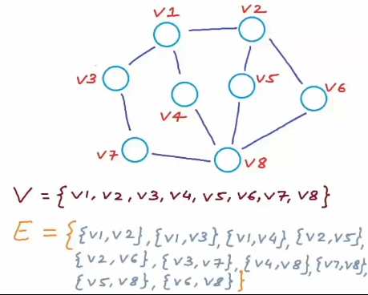
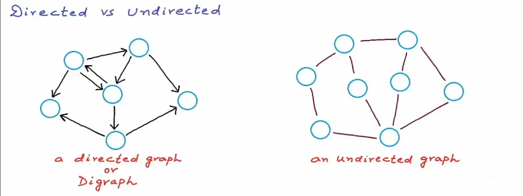
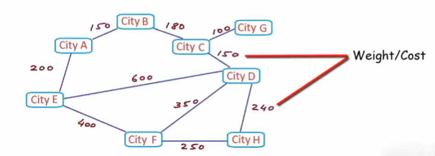

# 1. Introduction

- `Graph` is a collection of entities called Nodes or `Vertices` connected by `Edges`.

    

- In a tree, the connection of nodes goes `one-way` from root to leaf. In a graph, there is no root and nodes are connected in `two-way`.

- A graph `G` is an ordered pair of a set `V` of vertices and a set `E` of edges. `V` and `E` are `Sets`.

    ## G = (V, E)

> - Ordered pair:
> `(a,b) != (b,a)` if a != b
>
> - Unordered pair:
> `{a,b} = {b,a}`
>
> - Edges can be `directed` or `undirected`.
>
> 

- Here are sets of Vertices and Edges:

    

- There are two kinds of graph:

    

- A `weighted graph` is a graph whose edges are in different cost (or weight). An `unweighted graph` is a graph whose edges are the same cost (or weight).

    

# 2. Properties of Graph