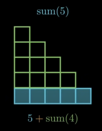
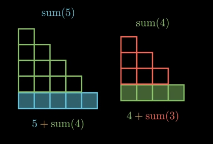
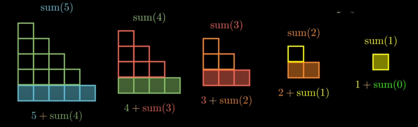
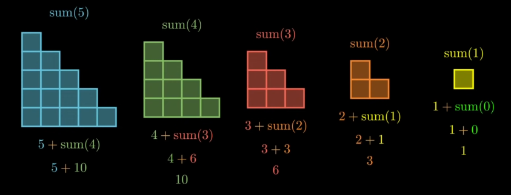

# 1. Introduction

- `Recursion` is the technique of making a function call itselft until a specified condition is met (base condition).

- On the way reaching base case, each recursive function will stop at `return` to wait for the result so that it can `stop` and `return` value. Once the base case is reached, the function starts returning the results in backward, one by one.

# 2. Problems

## a. Range sum

- To sum all numbers in range, we can use for-loop traditionally

    ```cpp
    int sum(int n) {
        int total = 0;

        for (int i=0; i<=n; i++) {
            total += i;
        }

        return total;
    }
    ```

- However, we can sum these number recursively.

    ```cpp
    int sum(int n) {
        if (n==0) {
            return 0;
        } else {
            return n + sum(n-1);
        }
    }
    ```

### Q: How does this code work?

- Let's say we call the function `sum(5)`. Since `5` is greater than 0 so the function will run this line:

    ```cpp
    return n + sum(n-1);

    // 5 + sum(4)
    ```

    

- However, we don't know what will `sum(4)` return. So, `sum(4)` will be recursively executed.

    

- Then, we continue until we reach `n=0` then we can solve the addition.

    
    

```cpp
// 5 + sum(4)
// 5 + (4 + sum(3))
// 5 + (4 + (3 + sum(2)))
// 5 + (4 + (3 + (2 + sum(1))))
// 5 + (4 + (3 + (2 + (1 + sum(0)))))
// 5 + (4 + (3 + (2 + (1 + 0))))
```

## b. Factorial

- Similar to the previous problem, we code will be:

```cpp
int factorial(int n) {
    if (n==1) {
        return 1;
    } else {
        return n * factorial(n-1);
    }
}
```

## c. Print N times

```cpp
void print(string s, int n) {
    if (n==0) {
        return;
    } else {
        cout << s << endl;
        n--;
        print(s, n);
    }
}
```