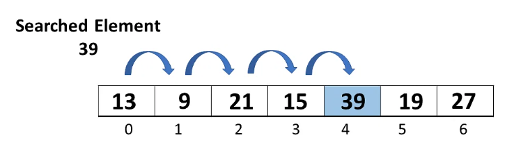
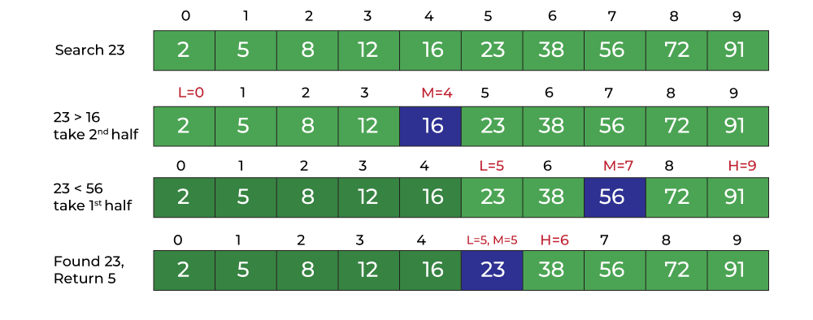

# 1. Introduction

- Searching algorithms are designed to check for an element from a data structure where it is stored.

# 2. Implementation

## a. Linear search (Sequential Search)

- `Linear Search` is a simple searching algorithm that sequentially checks each element in the list until a match is found (or the whole list has been searched).

    

```cpp
int linearSearch(int arr[], int target) {
    int size = sizeof(arr)/sizeof(int);

    for (int i = 0; i<size; i++) {
        if (arr[i] == target) {
            
            // return the index position
            return i;
        }
    }

    // target not found
    return -1;
}
```

## b. Binary Search (Interval Search)

- `Binary Search` is a more efficient searching algorithm for sorted arrays. It repeatedly divides the search interval in half until the target element is found (or the interval is empty).

    


- Solution 1: Using `recursion`.

    ```cpp
    int binarySearch(int arr[], int target, int left, int right) {
        
        if (left <= right) {

            int mid = (left + right)/2;
        
            if (target < arr[mid]) {
                return binarySearch(arr, target, left, mid-1);
            
            } else if (target > arr[mid]) {
                return binarySearch(arr, target, mid+1, right);
            
            } else if (target == arr[mid]) {
                return mid;
            }
        }
        
        return -1;
    }
    ```

- Solution 2: using `while loop`.

```cpp
int binarySearch(int arr[], int target, int size) {
    int left = 0;
    int right = size-1;
    
    while (left <= right) {
        int mid = (left + right)/2;
        
        if (target < arr[mid]) {
            right = mid - 1;

        } else if (target > arr[mid]) {
            left = mid + 1;

        } else if (target == arr[mid]) {
            return mid;
        }
    }
    
    return -1;
}
```