# 1. Introduction

- `Sorting algorithm` is used to rearrange a data structure according to a particular pattern (ascending or descending order).

- Most well-known sorting algorithms are:
    - [Bubble Sort](#a-bubble-sort)
    - [Selection Sort](#b-selection-sort)
    - [Insertion Sort](#c-insertion-sort)
    - [Merge Sort](#d-merge-sort)
    - [Heap Sort](#e-heap-sort)
    - [Quick Sort](#f-quick-sort)

# 2. Implementation

## a. Bubble Sort

- `Bubble Sort` is a simple comparison-based sorting algorithm which continously swapping two adjacent elements (which are in the wrong order) until the array is completely in correct order.

    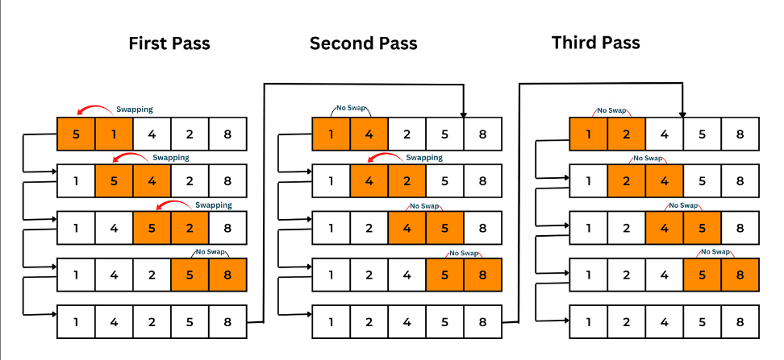

- Time complexity:
    - Best case: `O(n)`
    - Worst case `O(n^2)`

- `Outer loop` means how many times should the array be iterated again (this doesn't affect the inner loop). `Inner loop` means how many processes of swapping pairs of element in `one iteration` of outer loop.

- After one iteration, we the largest element will be shifted to the end of the array. Therefore, for the next time, we only need to iterate with `n-1` length.

> - `Bubble Sort` may cause excess pass (which means it doesn't need to loop `n` times in outer loop) if the array is completely sorted in `k` passes where `k < n`.
>
> - Therefore, we should a variable which checks whether the next pass should execute or not.

```cpp
void bubbleSort(int arr[], int size) {

    bool shouldSwap = true;
    
    // Outer loop
    for (int i=0; i < size; i++) {
        shouldSwap = false;

        // Inner loop
        for (j=0; j < size-i-1; j++) {

            if (arr[j] > arr[j+1]) {
                swap(arr[j], arr[j+1]);
                shouldSwap = true;
            }
        }

        // If no pairs are switched during the pass, which means the array is completely sorted
        if (shouldSwap == false) {
            break;
        }
    }

}
```


## b. Selection Sort

- `Selection Sort` is a technique which find the `smallest` element of `unsorted array` and switch that element with the `first element` of unsorted array. 

- Time complexity:
    - Best case: `O(n^2)`
    - Worst case: `O(n^2)`

    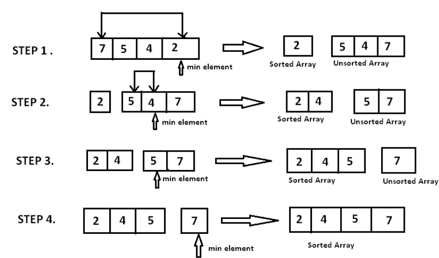

```cpp
void swap(int& x, int &y) {
    int temp = x;
    x = y;
    y = temp;
}

int minPosition(int arr[], int left, int right) {
    int m = left;

    for (int i=left; i<=right; i++) {
        if (arr[i] < arr[m]) {
            m = i;
        }
    }

    return m;
}

void selectionSort(int arr[], int right) {
    
    // Stop at second last element
    for (int i=0; i <= right-1; i++) {

        // Start from first element of unsorted array
        int minPos = minPosition(arr, i+1, right);

        // Swap if smallest element of unsorted array is smaller thant current element
        if (arr[minPos] < arr[i]) {
            swap(arr[minPos], arr[i]);
        }
    }
}
```

## c. Insertion Sort

- `Insertion Sort` operates by dividing an array ino two parts: `sorted` (left) and `unsorted` (right). The algorithm iteratively takes an element from the unsorted part and inserts it into the correct position in sorted part (by comparing it with the sorted elements).

- Time complexity: `O(n^2)`

- Steps for the sorting are:
    - **Step 1:** Pick an element and store it in `key`.

    - **Step 2**: Shift elements which are on the left side of `key` to the right if they are greater than key.

    - **Step 3:** When a left-side element is not greater than key (or when we reach the head of the array), stop the iteration and insert `key` right after that element.

    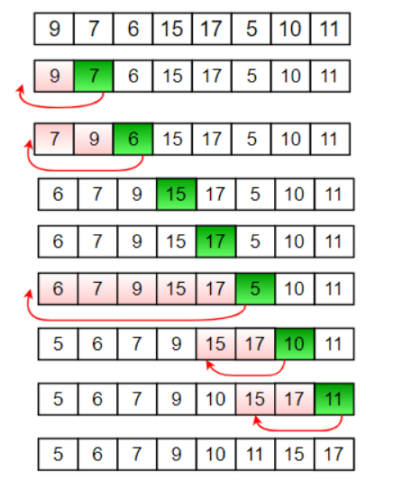

```cpp
void insertionSort(int arr[], int size) {
    int i, j, key;

    for (int i=1; i < size; i++) {
        key = a[i]; // element to be moved
        j = i - 1; // position of front element

        while (j >=0 && arr[j] > key) {
            arr[j + 1] = arr[j]; // shift elements;
            j = j - 1;
        }

        arr[j+1] = key; // insert key into the correct position
    }
}
```

- Here is an illustration of moving one element based on the code above. 

    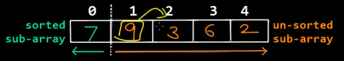
    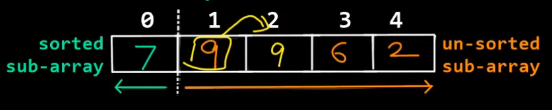
    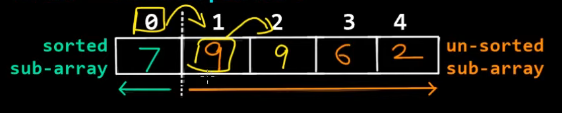
    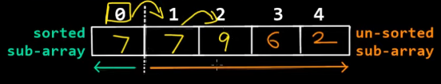
    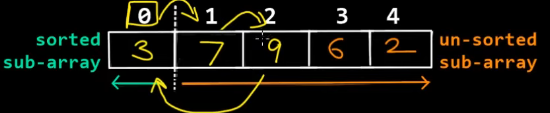

    > We store element `3` in variable `key` and start shifting `7` and `9` to the right while comparing with `3`. Then, we can put `3` into the correct placement, which is in front of `7` and `9`.

- Similarly, we can continue arranging element `6`.

    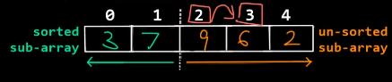
    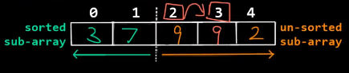
    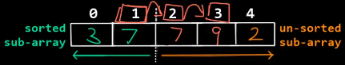
    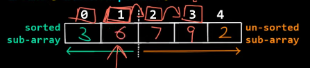

    > We stop at `3` and insert `6` right after `3` because it breaks the while loop condition (`3 > 6 is false`).

## d. Merge Sort

- `Merge Sort` is a `Divide and Conquer` algorithm which works by dividing an array into two smaller sub-arrays, recursively sorting these sub-arrays, then merging them back together in a sorted order. 

- It ensures that the smaller sub-arrays are sorted first and then combines them into a fully sorted array. This process continues until the entire array is sorted.

- Merge sort is one of the most efficient sorting algorithms.

- Time complexity: `O(nlog(n))`

    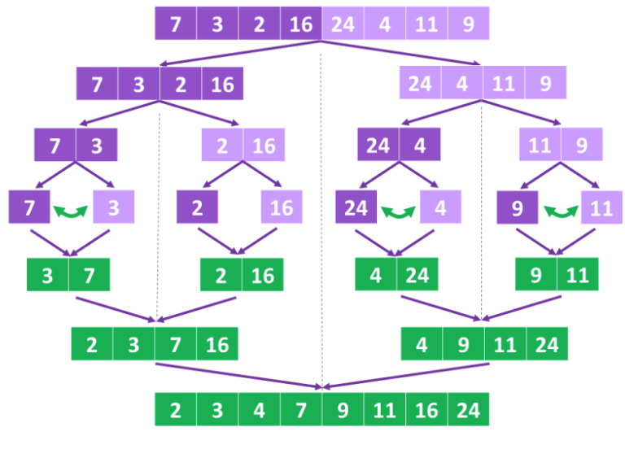

- To implement merge sort, we follow these steps:

    - **Step 1:** Find the middle point to divide the array into two sub-arrays.
        ```cpp
        int middle = (left + right) / 2
        ```
    - **Step 2:** Call `mergeSort` for the first sub-array.
        ```cpp
        mergeSort(arr, left, middle) 
        ```
    - **Step 3:** Call `mergeSort` for the second sub-array.
        ```cpp
        mergeSort(arr, middle+1, right)
        ```
    - **Step 4:** Call `merge` to merge two sorted sub-arrays.
        ```cpp
        merge(arr, left, middle, right)
        ```

    ### STEP 1. Divide sub-arrays

    ```cpp
    void mergeSort(int arr[], int left, int right) {

        // Check if the sub-array remains one element (left = right), so that it will not sort anymore.
        if (left < right) {

            // Find middle position
            int mid = (left + right) / 2;

            mergeSort(arr, left, mid);
            mergeSort(arr, mid + 1, right);

            merge(arr, left, mid, right);
        }
    }
    ```

    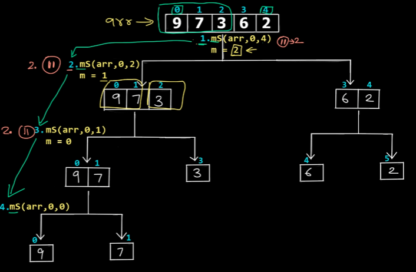

    > Like `In-Order traversal`, the algorithm will go to the right-most element then the left elements. After reaching two leaf elements, it returns to `merge`, which sorts the elements in the right order.

    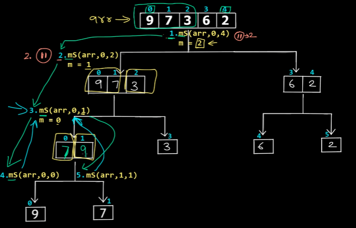

    - As shown in the graph above, we swapped `7` and `9`.

        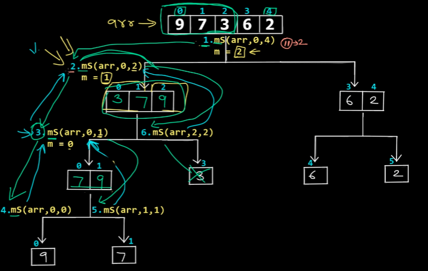

    - Now, we sorted `3`, `7` and `9` in the correct order.

        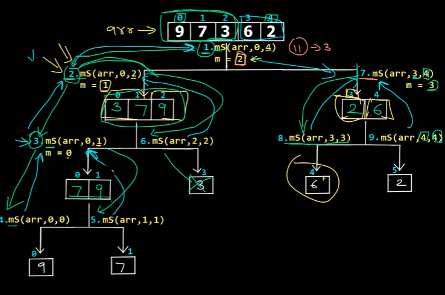

    - We do the same process for the right sub-array and both sub-arrays are sorted. Now the last `merge` will run by comparing the value in each position of left sub-array and right-array respectively, the push it to a `temporary array`. After that, we assign the temporary array to the original one.

    ### STEP 2. Sort sub-arrays

    - Assume that we are at level where `3,7,9` and `2,6` is about to be merged and become `2,3,6,7,9` (since it is the most complex one). Other lower levels are the same and more simple.

        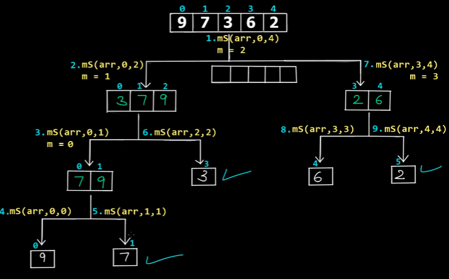

    - Now we have to keep track of 3 indexes, which are:
        - `i`: index in left sub-array.
        - `j`: index in right sub-array.
        - `k`: index in temporary array `temp[]` where elements will be put in sorted order.

        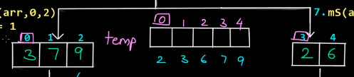

        ```cpp
        void merge(int arr[], int left, int mid, int right) {
            int i = left;
            int j = mid + 1;
            int k = left;

            int temp[right];
        }
        ```

    - Next, we need to check which element is `smaller` in the comparison between two left and right sub-arrays's first element. Then, we can transfer it to `temp[]`.

        ```cpp
        while (i <= mid && j <= right) {
            //...
        }
        ```

    - In the condition, we restrict the iteration not to be out of range:

        - `i <= mid`: restrict the while-loop to iterate only in the `left`. In this case `i = {3,7,9}`

        - `j <= right`: restrict the while-loop to iterate only in the `right`. In this case `j = {2,6}`

        ```cpp
        while (i <= mid && j <= right) {

            // Compare two first elements of left and right sub-array
            if (arr[i] <= arr[j]) {

                // Push element to temporary array
                temp[k] = arr[i];

                // Finish pushing, move index to the next element
                k++;
                i++;

            } else {
                temp[k] = arr[j];
                k++;
                j++;
            }

        }
        ```

    - Next, we can `compare` and `push` smaller element to `temp[]`. In this case, we push `2` to temp[] because `2 < 3`.

        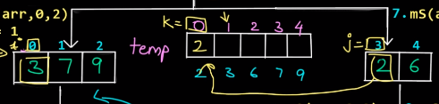

    - Similarly, after `2` is pushed to `temp[]`, we see `3 < 6`, so we push `3`.

        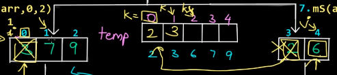

    - After pushing `6`, right sub-array is exhausted.

        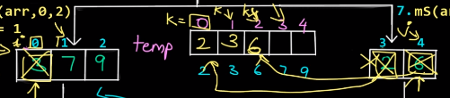

    - Now, we can see `j > right` so we exit the while loop. 

    - `temp[]` is now left with 2 spaces and it is about to be filled with 2 elements in right sub-array.

    - Therefore, we need another while loop which can push all remained elements to `temp[]` (note that remained elements are sorted).

        ```cpp
        // Push all remained elements from left sub-array to temp[]
        while (i <= mid) {
            temp[k] = arr[i];
            k++;
            i++;
        }

        // Push all remained elements from left right-array to temp[]
        while (j <= right) {
            temp[k] = arr[j];
            k++;
            j++;
        }
        ```

        > There is case when 2 while loop need to run. There is also case when 1 out of 2 while loop need to run.

        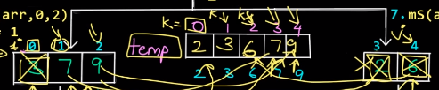

    - Finally, we update the original array using data from the temporary array.

        ```cpp
        for (int l=left; l <= right; l++) {
            arr[l] = temp[l];
        }
        ```

    ### STEP 3. Final code

    ```cpp
    void merge(int arr[], int left, int mid, int right) {
        int i = left;
        int j = mid + 1;
        int k = left;

        int temp[right];
        
        while (i <= mid && j <= right) {

            // Compare two first elements of left and right sub-array
            if (arr[i] <= arr[j]) {
        
                // Push element to temporary array
                temp[k] = arr[i];
        
                // Finish pushing, move index to the next element
                k++;
                i++;
        
            } else {
                temp[k] = arr[j];
                k++;
                j++;
            }
        }
        
        while (i <= mid) {
            temp[k] = arr[i];
            k++;
            i++;
        }
        
        // Push all remained elements from left right-array to temp[]
        while (j <= right) {
            temp[k] = arr[j];
            k++;
            j++;
        }
        
        for (int l=left; l <= right; l++) {
            arr[l] = temp[l];
        }
    }

    void mergeSort(int arr[], int left, int right) {

        // Check if the sub-array remains one element (left = right), so that it will not sort anymore.
        if (left < right) {

            // Find middle position
            int mid = (left + right) / 2;

            mergeSort(arr, left, mid);
            mergeSort(arr, mid + 1, right);

            merge(arr, left, mid, right);
        }
    }


    int main() {
        int arr[] = {7,6,3,2,9,8,7,5,10};
        int size = sizeof(arr) / sizeof(int);
        
        mergeSort(arr, 0 , size-1);
        
        for (int i=0; i< size; i++) {
            cout << arr[i] << " ";
        }
        
        return 0;
    }
    ```

## e. Heap Sort

- `Heap sort` is a comparison-based sorting algorithm that uses a `heap data structure` to sort a list of elements.

- Heap sort works by first converting the input list into a `(max) heap`. Then, similar to `Bubble Sort`, the maximum element will be shifted to the end of the array. We continously iterating until heapifying the reduced heap until the heap is empty.

- Time complexity: `O(n log(n))`

    ### STEP 1. Build heap from array

    ```cpp
    void heapify(int arr[], int size, int index) {

        // Assume the current node is largest
        int largest = index;
        
        // Calculate the index of left and right child
        int left = (2 * index) + 1;
        int right = (2 * index) + 2;

        // Check if the left is larger than the current largest
        if (left < size && arr[left] > arr[largest]) {
            largest = left;
        }

        // Check if the right is larger than the current largest
        if (right < size && arr[right] > arr[largest]) {
            largest = right;
        }

        // If the largest node is not the current node, swap them and recursively heapify
        if (largest != index) {
            swap(arr[index], arr[largest]);
            heapify(arr, size, largest);
        }
    }
    ```

    ### STEP 2. Sort

    ```cpp
    void heapSort(int arr[], int size) {
        // Build max heap from the array
        for (int i = size / 2 ; i >= 0; i--) {
            heapify(arr, size, i);
        }

        // Swap first and last element, then heapify with decreasing length
        for (int i = size-1; i > 0; i--) {

            // Move the first (maximum) element to the end
            swap(arr[0], arr[i]);
            
            // Heapify the reduced heap
            headpify(arr, i, 0);
        } 
    }
    ```

    > Note:
    > Detailed explanation can be found at [here](../../1.%20Data%20Structure/1.5.%20trees/heap.md)

## f. Quick Sort

- `Quick Sort` is a `Divide and Conqueur` algorithm. It works by selecting a pivot and partitioning the array around it so that all elements which are `smaller` than the pivot are placed `before` it and all elements which are `greater` are placed `after` it. The algorithm then recursively sorts the two sub-arrays.

- Quick Sort is an `in-place` sorting algorithm, which doesn't require creating temporary array, instead, it swaps/replaces/shifts elements on the `same array`.

    > Quick Sort use less memory than Merge Sort since it doesn't create temporary arrays while sorting.

- Quick Sort is one of the most efficient sorting algorithm.

- Time complexity: `O(n log(n))`

    ### STEP 0. Overview

    - Our base code looks like:

        ```cpp
        void quickSort(int arr[], int start, int end) {

            if (start < end) {

                int p = partition(arr, start, end);

                // Left sub-array
                quickSort(arr, start, p-1);

                // Right sub-array
                quickSort(arr, p+1, end);
                
            }
        }
        ```

    ### STEP 1. Choose a pivot 

    - First, we choose a pivot index (usually the last element)

        ```cpp
        int parition(int arr[], int start, int end) {

            int pivot = arr[end];
            int pIndex = start;

            // ...
        }
        ```

    - Then, we start moving lesser elements to the left of pivot and greater elements to the right.

        ```cpp
        // Arranging smaller and greater sub-arrays
        for (int i=start; i <= end-1; i++) {
            if (arr[i] <= pivot) {
                swap(arr[i], arr[pIndex]);
                pIndex++;
            }
        }

        // Move the pivot to boundary of two sub-arrays
        swap(arr[end], arr[pIndex]);

        return pIndex;
        ```

        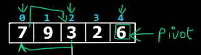
        
        - First, we swap `3` and `7` since `3 < 7`. Then, we swap `2` and `9`.
            > `pIndex` increases by one each swapping.

            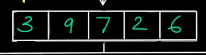
            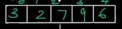

        - Finally, we move the pivot to the boundary (swap `6` and `7`) where `pIndex = 2`.

            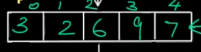
        
        - Now, we can return `pIndex`.
    
    ### STEP 2. Partitioning

    - We recursively divide the array into two sub-arrays and perform `quickSort` on them. By swapping `pivot` and `pIndex` continuously, the array will be sorted ascendingly.

        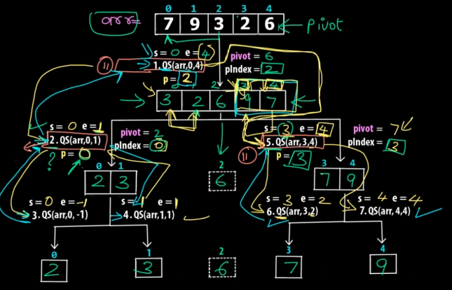

    ### STEP 3. Final code

    ```cpp
    int partition(int arr[], int start, int end) {

        int pivot = arr[end];
        int pIndex = start;

        for (int i=start; i <= end-1; i++) {
            if (arr[i] <= pivot) {
                swap(arr[i], arr[pIndex]);
                pIndex++;
            }
        }

        // Move the pivot to boundary of two sub-arrays
        swap(arr[end], arr[pIndex]);

        return pIndex;
    }

    void quickSort(int arr[], int start, int end) {

    if (start < end) {

        int p = partition(arr, start, end);

        // Left sub-array
        quickSort(arr, start, p-1);

        // Right sub-array
        quickSort(arr, p+1, end);
        
        }
    }
    ```