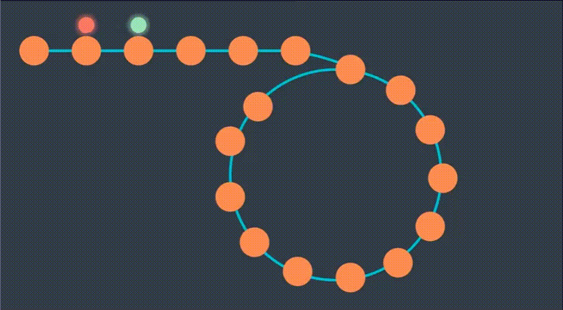

# 1. Introduction

- `Floyd's cycle detection` or `Hare-Tortoise` algorithm is a pointer algorithm that use `two pointers`, moving through the sequence at different speed. This algorithm is used to find a cycle in a linked list.

- Time complexity: `O(n)`

# 2. Implementation

- There are two pointers, one moving twice as fast as the other one. The faster one is called `hare` and the slower one is called `tortoise`.

    

- If the `hare` reach the end (NULL), there will be no cycle.

    

- Otherwise, when the `hare` catches the `tortoise`, a cycle is detected.

    

    ```cpp
    bool detectCycle(Node* head) {
        Node *slow = head, *fast = head;

        while (fast != nullptr) {
            slow = slow->next;
            fast = fast->next->next;

            if (slow == fast) {
                return true;
            }
        }

        return false;
    }
    ```

- In case we want to find the `entry point` of the cycle, whenever the hare catches the tortoise, we take the tortoise back to the beginning. Then they can continue running at the `same speed` until they meet again, and that is when an entry point is detected.

    

    ```cpp
    Node* detectCycleEntryPoint(Node* head) {
        Node *slow = head, *fast = head;
        bool met = false;

        while (fast != nullptr) {
            slow = slow->next;
            fast = fast->next->next;

            if (slow == fast) {
                met = true;
                break;
            }
        }

        // If met, start running at the same speed until an entry point is found
        if (met) {
            slow = head;
            while (slow != fast) {
                slow = slow->next;
                fast = fast->next;
            }
        } else {
            return nullptr;
        }

        return slow;
    }
    ```
