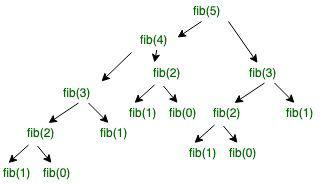

# 1. Introduction

- `Dynamic Programming` is an algorithm paradigm which solves a complex problem by breaking it into `subproblems` using recursion and `storing` the results to avoid computing the same results again.


# 2. Problems

- The Fibonacci sequence is a well-known mathematical series that starts with 0 and 1, where each subsequent number is the sum of the two preceding ones.

- Example: `0 1 1 2 3 5 8 ...`

- To get value of a nth number, we calculate using `F(n) = F(n-1) + F(n-2)` for `n > 1`.

    ```cpp
    int fib(int n) {
        if (n <= 1) {
            return n;
        } 

        return fib(n-1) + fib(n-2);
    }
    ```

- Here is the illustration for fibonacci of `5`.

    

- As we can see, for instance, `fib(2)`  are called 2 times. If we stored the savlue of `fib(2)` instead of computing it again, we could save the memory.

- Therefore, we have two different ways to reuse those values:
    - `Memoization` (Top Down)
    - `Tabulation` (Bottom Up)

# 3. Approach

## a. Memoization

- We initialize a lookup table store value of each subproblems we have solved. Whenever we need to solve a new subproblems, we first check the table.

- If we find the result for the current subproblem, we simply take that without wasting time computing again. Otherwise, we have to compute and store new value so that it can be reused later.

- Time complexity: `O(n)`
- Space complexity: `O(n)`

### (*) Implementation

- First, we fill our lookup table with a suitable length and fill it with `-1`.

    ```cpp
    #define MAX 100;

    int lookup[MAX];

    void _initialize() {
        for (int i=0; i<MAX; i++) {
            lookup[i] = -1;
        }
    }
    ```

- Then we can modify our primary code

    ```cpp
    int fib(int n)
    {
        if (n <= 1) {
            return n;
        }

        // Check if the result for `n` is already computed
        if (lookup[n] != -1) {
            return lookup[n];
        }
        
        // Otherwisze, we store new value
        lookup[n] = fib(n-1) + fib(n-2);

        return lookup[n];
    }
    ```

## b. Tabulation

- We build a table in an increasing order value and return the last value from the table. For instance, for fibonacci sequence, if we can to calculate `fib(5)`, we calculate `fib(1)` then `fib(2)` then `fib(3)` then `fib(4)` then `fib(5)`. Finally, we return `fib(5)` since it is the last entry of our table.

- Time complexity: `O(n)`
- Space complexity: `O(n)`

    ```cpp
    int fib(int n) {

        int lookup[n+1];
        lookup[0] = 0;
        lookup[1] = 1;

        for (int i=2; i<=n; i++) {
            lookup[i] = lookup[i-1] + lookup[i-2];
        }

        return lookup[n];
    }
    ```

    > We can also use variables instead of array.

    ```cpp
    int fib(int n) {

        int prev2 = 0, prev1 = 1, current = -1;

        for (int i=2; i<=n; i++) {
            current = prev1 + prev2;

            prev2 = prev1;
            prev1 = current;
        }

        return current;
    }
    ```