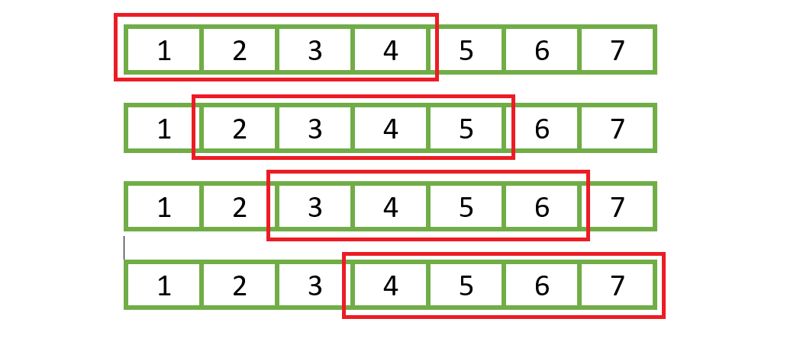

# 1. Introduction

- `Window Sliding Technique` is a computational technique that aims to reduce the use of nested loops and replace it with a single loop.

- The way it works can be considered as a `subarray` (or window) which slides through the `array` to implement calculations.

    

# 2. Implementation

## a. Prompt

- Given an array of integers of size `N` and target subarray's length `k`. Find the consecutive subarray with maximum sum.

```
- Input: arr[] = {100,200,300,400}, k = 2
- Output: 700
```

## b. Approach

- First, we will go throught `brute force` approach, which uses nested loop.

- Time complexity: `O(k*n)`

    ```cpp
    int maxSum(int arr[], int n, int k)
    {
        // Invalid
        if (n < k) {
            return -1;
        }

        int max_sum = -1;
    
        // Consider all blocks starting with i.
        for (int i = 0; i <= n - k; i++) {
            int current_sum = 0;
            for (int j = 0; j < k; j++)
                current_sum = current_sum + arr[i + j];
    
            // Update result if required.
            max_sum = max(current_sum, max_sum);
        }
    
        return max_sum;
    }
    ```

- Then, we can reduce the time complexity using `sliding window` approach. By sliding the subarray, we remove its head element and add new tail element. Therefore, we create `current_sum` to store the sum of `k` elements on the go and compare it with `max_sum`.

    ```cpp
    int maxSum(int arr[], int n, int k) {
        // Invalid
        if (n < k) {
            return -1;
        }

        int max_sum = 0;

        // Compute sum of first window
        for (int i=0; i<k; i++) {
            max_sum += arr[i];
        }

        // Start sliding and computing remained windows
        int window_sum = max_sum;
        for (int i=0; i < n-k; i++) {
            window_sum += arr[i+k] - arr[i];
            max_sum = max(max_sum, window_sum);
        }

        return max_sum;
    }
    ```