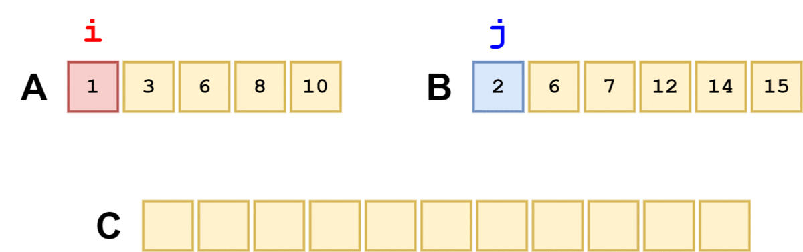

# 1. Introduction

- `Two pointers` is a technique that is typically used for searching pairs in a sorted array.

# 2. Implementation
## a. Find pair sum

- Given a sorted array of size `N`, check if there is a pair sum which is equal to target number `k`.

    > - Input arr[] = {10, 20, 35, 50, 75, 80}, k = 70
    > - Output: `true` (20,50)

### (*) Brute force approach

```cpp
bool isPairSum(int A[], int N, int X)
{
    for (int i = 0; i < N-1; i++) {
        for (int j = i+1; j < N; j++) {
 
            // pair exists
            if (A[i] + A[j] == X)
                return true;
 
            // as the array is sorted
            if (A[i] + A[j] > X)
                break;
        }
    }
 
    // No pair found with given sum.
    return false;
}
```

### (*) Two pointers approach

- To perform this technique, we first set one pointer at the `beginning` of the array, and another pointer at the `end`.

- Then, we can start comparing with the target number. If our pair is `greater` than target, decrease the `second pointer`. If our pair is `lesser` than target, increase the `first pointer`.

- Illustration:
    ```
    arr[] = {10, 20, 35, 50, 75, 80}

    - A[0] + A[5] = 10 + 80 = 90 > 70  ==>  A[5] -> A[4]
    - A[0] + A[4] =  10 + 75 = 85 > 70  ==>  A[4] -> A[3]
    - A[0] + A[3] = 10 + 50 = 60 < 70  ==>  A[1] -> A[3]
    - A[1] + A[3] = 20 + 50 = 70  ==>  Found
    ```

    ```cpp
    bool isPairSum(int A[], int N, int X)
    {
        int p1 = 0, p2 = N-1;

        while (p1 < p2) {
            // Greater -> decrease
            if (A[p1] + A[p2] > X) {
                p2--;
            
            // Lesser -> increase
            } else if (A[p1] + A[p2] < X) {
                p1++;

            } else {
                return true;
            }  
        }

        return false;
    }
    ```

## b. Merge sorted array

- Given two sorted array `A` and `B`, merge those array into a new array while keeping the sorted order.

    > - Input: A[] = {1, 3, 5, 7}, B[] = {2, 4, 6}
    > - Output: C[] = {1, 2, 3, 4, 5, 6, 7}

### (*) Approach



```cpp
vector<int> merge(int A[], int B[], int N, int M) {

    int p1 = 0, p2 = 0;
    vector<int> C;

    while (p1 < N || p2 < M) {

        // Whichever element is smaller will be added to new array
        if (A[p1] < B[p2]) {
            if (p1 < N) {
                C.push_back(A[p1]);
                p1++;
            
            // Run out of elements in `A`, fill all remained elements from `B`
            } else {
                C.push_back(B[p2]);
                p2++;
            }
        } else if (A[p1] >= B[p2]) {
            if (p2 < M) {
                C.push_back(B[p2]);
                p2++; 
            
            // Run out of elements in `B`, fill all remained elements from `A`
            } else {
                C.push_back(A[p1]);
                p1++;
            }
        }
    }

    return C;
}
```

## c. Remove target element

- [https://leetcode.com/problems/remove-element/description/](https://leetcode.com/problems/remove-element/description/)

### (*) Idea

- Since the prompt requires in-place arrangement, we have to create `two pointers`:
    - First pointer (`i`) will iterate through every element in the array.
    - Second pointer (`count`) will follow the first one and stop at position where we encounter `target element` while `i` is going through. 

- When `i` pass the target element, `count` continues to update `i`'s value because we don't want target element to appear in our array.

    > It doesn't matter what elements are left behind our `count` length.

    ```cpp
    int removeElement(vector<int>& nums, int val) {
        int count = 0;

        for (int i=0; i< nums.size(); i++) {
            if (nums[i] != val) {
                nums[count] = nums[i];
                count++;
            }
        }

        return count;
        
    }
    ```